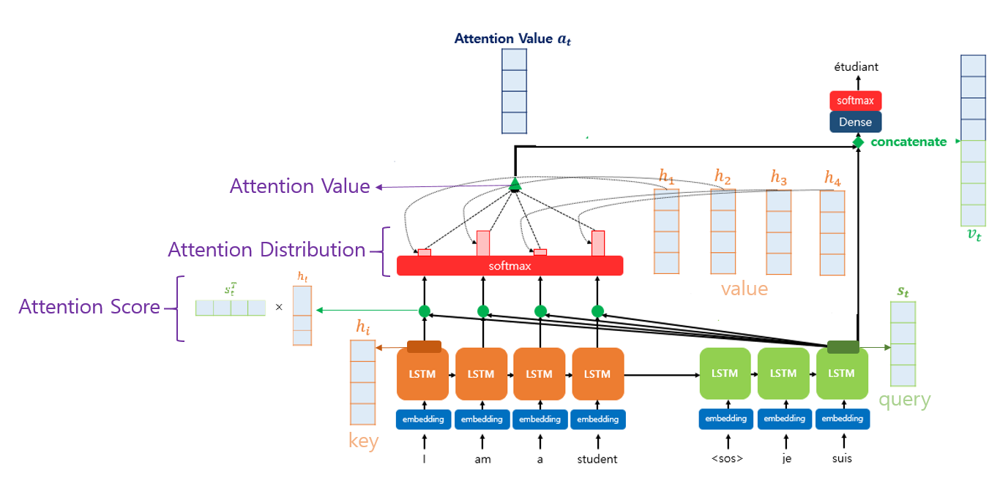
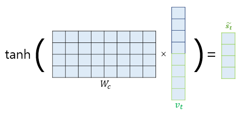
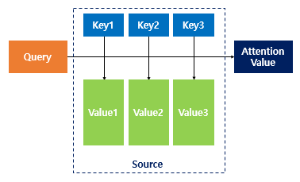
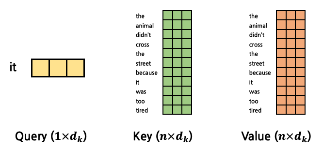
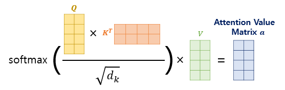

seq2seq 모델 + attention 모델 에서 attention에 대해 알아보자.  
다음은 I am a student 에 대한 번역문의 3번째 단어를 유추하는 상황이다. 

   

- <b>Attention Score</b> : Query 와 Key 의 유사도. 입력 데이터의 특정 부분이 다른 부분에 얼마나 중요한지(즉, 얼마나 관련이 있는지)를 측정한다. 
- <b>Attention Distribution</b> : Attention distribution은 Attention score를 확률 분포로 변환한 것. oftmax 함수를 사용하여 Attention score를 정규화. 
- <b>Attention value</b> : Attention distribution에 Value Vector를 가중합한 결과. 입력 데이터의 중요한 정보를 추출한 결과로, 다음 단계(예: 디코더, 출력 계층)로 전달된다.  

### 동작순서

1. <b>Attention Score를 구한다.</b>

    $$
    \text{score}(s_t, h_i) = s_t^T h_i
    $$

     

    Attention Score의 모음값을 $e^t$라고 정의하면 $e^t$는 다음과 같다.

    $$
    e^t = \left[s_t^T h_1, \dots, s_t^T h_N\right]
    $$

      

2. <b>softmax 함수를 통해 Attention Distribution을 구한다.</b>

    $$
    \alpha^t = \text{softmax}(e^t)
    $$

      

3. <b>각 인코더의 Attention Distribution과 은닉 상태(Value Vector)를 가중합하여 Attention Value(Context Vector) $a_t$을 구한다.</b>

    $$
    a_t = \sum_{i=1}^{N} \alpha_i^t h_i
    $$

      

4. <b>Attention Value 와 디코더의 t 시점의 은닉 상태(Query Vector)를 연결한다.</b>

     

5. <b>출력층 연산의 입력이 되는 $\tilde{s}_t$ 를 계산한다.</b>

    

     
    

    $$
    \tilde{s}_t = \tanh(\mathbf{W}_c [a_t ; s_t] + \mathbf{b}_c)
    $$

    $$
    \mathbf{W}_c:\text{학습 가능한 가중치 행렬} \\
    \mathbf{b}_c:\text{bias (그림에서는 생략됨)}
    $$

     

    논문에서는 $v_t$를 바로 출력층으로 보내기전에 신경망 연산을 한 번 더 추가하였다.  
    가중치 행렬과 곱한 후에 하이퍼볼릭탄젠트 함수를 지나도록 하여 출력층 연산을 위한 새로운 벡터인 $\tilde{s}_t$를 얻는다.

     

6. <b>$\tilde{s}_t$ 를 출력층의 입력으로 사용하여 예측 벡터인 $\hat{y}_t$를 얻는다.</b>

    $$
    \hat{y}_t = \text{Softmax}\left(W_y \tilde{s}_t + b_y\right)
    $$

      

### Query, Key, Value 란?

   

- <b>Q = Query</b> - t시점의 'Decoder'의 은닉상태(현재 우리가 유추해야하기 위한 정보에 대한 은닉벡터 값) 
- <b>K = Key</b> - 모든 시점의 'Encoder'의 은닉상태들(Query와 얼마나 연관되어있는지 체크해야할 Encoder의 은닉벡터 값들) 
- <b>V = Value</b> - 모든 시점의 'Encoder'의 은닉상태들(Key로 꺼내온 Encoder의 은닉벡터 값들) 

**Query**가 현재 선택된 단어를 이해하기 위해서는 문장 내에서 어떤 단어에 주목해야 하는지를 묻는다.  
그러면 **Key**가 각각의 단어를 대표하여 자기 자신이 선택된 단어를 이해하기 위해서 얼마나 중요한 역할을 하는지를 답한다.  
마지막으로 **Value**는 각각의 단어가 실제로 갖고 있는 정보를 제공한다.

   

 

attention에서 Key 와 Value는 동일한 입력(단어)로부터 생성된다. self-attention 의 경우 Query, Key, Value 모두 동일한 입력(단어)로부터 생성된다. 
다만 서로 다른 학습된 가중치 행렬에 의해 다른 값들을 갖게 된다.  

위의 Query, Key, Value 가 주어졌을때, Attention Value는 다음과 같이 구할 수 있다.

$$
\text{Attention}(Q, K, V) = \text{softmax}\left(\frac{QK^T}{\sqrt{d_k}}\right)V
$$

   

 

Query와 Key의 차원이 커지면 내적 값은 Attention score도 커지게 되어 모델의 학습에 어려움이 생긴다. 
&nbsp;때문에 이 문제를 해결하기 위해 차원 $d_k$의 루트만큼을 나누어 주는 스케일링 작업을 진행한다. 