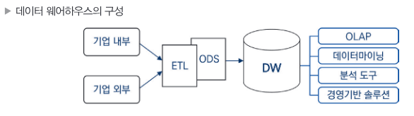
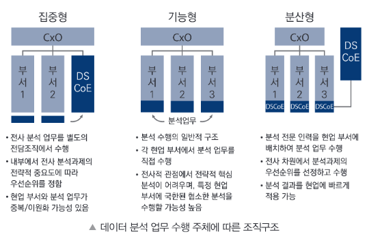

## 빅데이터 개요 및 활용

### 1.데이터와 정보

#### 데이터의 유형

- **정형 데이터**(Structured Data) : 정해진 형식과 구조에 맞게 저장된 데이터. 연산 가능. (ex. 관계형 DB에 저장되는 데이터)

- **반정형 데이터**(Semi-structured Data) : 스키마 정보를 데이터와 함께 제공하는 파일 형식의 데이터. 연산 불가능 (ex. json, xml 등...)

- **비정형 데이터**(Unstructured Data) : 구조가 정해지지 않은 대부분의 데이터. 연산 불가능 (ex. 동영상, 이미지, 메일 등...)

#### 데이터의 구분

- **정량적 데이터**(Quantitative Data) : 숫자로 이루어진 데이터 (ex. 2020년, 100km/s 등... - **정형**,**반정형** 데이터 위주)

- **정성적 데이터**(Qualitative Data) : 문자와 같은 텍스트로 이루어진 데이터. 함축적 의미 내포. (ex. 철수가 시험에 합격하였다. - **비정형** 데이터 위주)

#### 데이터 근원에 따른 분류

- **가역 데이터** : 원본 상태로 되돌릴 수 있는 데이터

- **비가역 데이터** : 한번 변환되거나 처리되면 원본 상태로 되돌릴 수 없는 데이터

| 가역 데이터                  |   | 비가역 데이터            |
|------------------------|------|---------------------|
| 가능      | 환원성(추적성) | 불가능 |
| 1:1 | 원본과 관계 | 1:N, N:1 또는 M:N |
| 데이터 마트, 데이터 웨어하우스 | 활용분야 | 데이터 전처리, 프로파일 구성 |

  

### 2.데이터베이스

#### 데이터베이스의 특징
- **통합된 데이터**(Integrated Data)
    동일한 데이터가 중복 저장 하지 않음.

- **저장된 데이터**(Stored Data)

- **공용 데이터**(Shared Data)
    여러 사용자가 데이터를 함께 이용

- **변화하는 데이터**(Changed Data)
    최신 데이터로 지속 갱신

#### 데이터베이스의 주요 처리 방식

- **OLTP**(OnLine Transaction Processing)
    데이터베이스의 데이터를 수시로 갱신하는 프로세싱. 현재 시점의 데이터만을 데이터베이스가 관리한다는 개념.

- **OLAP**(OnLine Analytical Processing)
    OLTP 에서 처리된 트랜잭션 데이터를 분석해 비즈니스 분석(판매 추이, 재무회계 등...)을 프로세싱.

|OLTP| |OLAP|
|---|---|---|
|실시간 트랜잭션 처리|목적|데이터 분석 및 의사결정|
|정규화(중복 최소화)|데이터 구조|비정규화(조회 성능 최적화)|
|insert, update, delete|연산 유형|select, join, group by|
|짧은 응답시간|성능 최적화|대량 데이터 조회 최적화|
|은행, 전자상거래|예시|데이터 웨어하우스, BI 시스템|

#### 데이터 웨어하우스(DW: Data Warehouse)

시스템의 데이터베이스에 축적된 데이터를 공통 형식으로 변환하여 관리하며 분석 방법까지 포함하여 조직 내 의사결정을 지원하는 정보 관리 시스템.

#### 데이터 웨어하우스 특징

- **주제지향성**(Subject-orientation) : 중요 주제 중심으로 그 주제와 관련된 데이터로 구성

- **통합성**(Integration) : 전사적 관점으로 이관된 형태로 변환.

- **시계열성**(Time-variant) : 시간을 기준으로 데이터를 축적하고 분석. 데이터를 시간에 따라 장기 보관.

- **비휘발성**(Non-volatilization) : 데이터가 한번 저장되면 일괄 처리작업 외에는 그대로 유지.

#### 데이터 웨어하우스 구성

   

- **ODS**(Operational Data Store) : 다양한 DBMS 시스템에서 추출한 데이터를 통합관리.

  

### 3.빅데이터 개요

- 작은 용량의 데이터에서는 얻을 수 없던 새로운 통찰이나 가치를 추출
- 데이터의 가치 판단 기준이 질(quality) 보다 양(quantity) 로 변화
- 데이터 분석 방향이 이론적 인과관계 중심에서 단순한 상관관계로 변화 (데이터 기반의 상관관계 분석으로 특정 현상의 발생 가능성을 포착하여 대응 하는 방식으로 변화)

#### 빅데이터 특징 (5V)

- **가트너(Gartner) 그룹의 3V**
    - **규모(Volume)** : 데이터 대용량화
    - **다양성(Variety)** : 데이터 다양화
    - **속도(Velocity)** : 데이터 수집 및 처리속도 고속화

- **+2V**
    - **품질(Veracity)** : 고품질 데이터 중요
    - **가치(Value)** : 분석을 통해 얻는 가치

#### 빅데이터 활용

- **빅데이터 활용을 위한 3요소**
    - **자원(Resource)** : 자원 확보
    - **기술(Technology)** : 저장, 관리, 처리 기술
    - **인력(People)** : 분석, 도메인 지식 인력

  

### 5.데이터 산업의 이해

#### 데이터 산업의 진화

    <b>처리 > 통합 > 분석 > 연결 > 권리</b>

 

- 데이터 **처리**시대 (1970 ~ 1980) : 데이터는 업무 처리의 대상. 새로운 가치 제공하지 않았음.
- 데이터 **통합**시대 (1990 ~ 2000) : 데이터 모델링과 DBMS 등장. 데이터 웨어하우스 도입.
- 데이터 **분석**시대 (2010 ~ ) : 데이터 폭발적 증가. 하둡,스파크 등 빅데이터 기술 등장. 인공지능 기술 사용화
- 데이터 **연결**시대 (2018 ~ ): 다양한 기업들의 서비스 연결.
- 데이터 **권리**시대 : 자신의 데이터에 대한 권리를 보유하고 있으며 스스로 행사 할 수 있어야 한다는 마이데이터(My Data) 등장

  

### 6.빅데이터 조직 및 인력

#### 조직의 구성

   

- **DSCoE**(Data Science Center of Excellence) : 분석전담조직

  

## 빅데이터 기술 및 제도

### 1.빅데이터 플랫폼

빅데이터 수집부터 저장, 처리, 분석 등 전과정을 통합적으로 제공.

#### 빅데이터 플랫폼의 기능

- 컴퓨팅 부하 해소
- 저장 부하 해소
- 네트워크 부하 해소

#### 빅데이터 플랫폼의 구조

- **소프트웨어 계층** : 데이터 수집, 정제, 처리, 분석 수행
- **플랫폼 계층** : 빅데이터 어플리케이션 실행을 위한 플랫폼 제공. 작업 스케쥴링, 데이터 및 자원 할당, 프로파일링 등 수행.
- **인프라스트럭쳐 계층** : 스토리지,네트워크,노드 관리 등 자원 제공 및 배치 수행.

  

### 2.빅데이터 처리기술

#### 빅데이터 처리과정과 요소기술

    <b>생성 > 수집 > 저장(공유) > 처리 > 분석 > 시각화</b>

 

- **수집**
    - 크롤링(Crawling)
    - 로그수집기
    - 센서 네트워크 
    - RSS Reader/Open API
    - ETL 프로세스

- **저장**
    - NoSQL(Not-only SQL)
    - 공유 데이터 시스템(Shared-data System) : 일관성, 가용성, 분할내성 중 최대 2개의 속성만 보유 할 수 있다(CAP 이론). 분할 내성을 취하고 일관성과 가용성중 하나를 포기하여 일관성과 가용성을 모두 취하는 기존 RDBMS보다 높은 성능과 확장성 제공.
    - 병렬 데이터베이스 관리 시스템(Parallel Database Management System) 
    - 분산 파일 시스템 : 네트워크로 공유하는 여러 호스트 파일에 접근 할 수 있는 파일 시스템. 데이터를 분산 저장하면 데이터 추출시 빠르게 처리 가능. (ex. HDFS, GFS, S3)
    - 네트워크 저장 시스템 : 데이터 저장 장치를 하나의 데이터 서버에 연결하여 저장관리. (ex. NAS, SAN) 

- **처리**
    - 분산 시스템 : 네트워크상 분산되어있는 컴퓨터를 단일 시스템인 것 처럼 구동하는 기술.
    - 병렬 시스템 : CPU 등 자원을 데이터 버스나 지역 통신 시스템 등으로 연결하여 구동하는 기술. 분할된 작업을 동시에 처리.
    - 분산 병렬 컴퓨팅(분산 시스템 + 병렬 시스템) : 다수의 독립된 컴퓨팅 자원을 네트워크상에 연결하여 미들웨어를 이용해 하나의 시스템으로 동작하게 하는 기술.