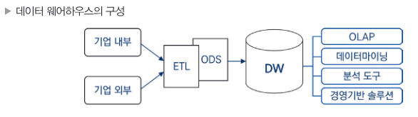
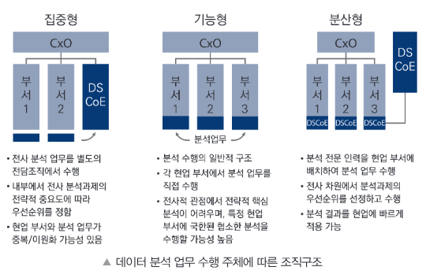

# 빅데이터의 이해

## 빅데이터 개요 및 활용

### 1.데이터와 정보

#### - 데이터의 유형

- **정형 데이터**(Structured Data) : 정해진 형식과 구조에 맞게 저장된 데이터. 연산 가능. (ex. 관계형 DB에 저장되는 데이터)

- **반정형 데이터**(Semi-structured Data) : 스키마 정보를 데이터와 함께 제공하는 파일 형식의 데이터. 연산 불가능 (ex. json, xml 등...)

- **비정형 데이터**(Unstructured Data) : 구조가 정해지지 않은 대부분의 데이터. 연산 불가능 (ex. 동영상, 이미지, 메일 등...)

#### - 데이터의 구분

- **정량적 데이터**(Quantitative Data) : 숫자로 이루어진 데이터 (ex. 2020년, 100km/s 등... - **정형**,**반정형** 데이터 위주)

- **정성적 데이터**(Qualitative Data) : 문자와 같은 텍스트로 이루어진 데이터. 함축적 의미 내포. (ex. 철수가 시험에 합격하였다. - **비정형** 데이터 위주)

#### - 데이터 근원에 따른 분류

- **가역 데이터** : 원본 상태로 되돌릴 수 있는 데이터

- **비가역 데이터** : 한번 변환되거나 처리되면 원본 상태로 되돌릴 수 없는 데이터

| 가역 데이터                  |   | 비가역 데이터            |
|------------------------|------|---------------------|
| 가능      | 환원성(추적성) | 불가능 |
| 1:1 | 원본과 관계 | 1:N, N:1 또는 M:N |
| 데이터 마트, 데이터 웨어하우스 | 활용분야 | 데이터 전처리, 프로파일 구성 |

  

### 2.데이터베이스

#### - 데이터베이스의 특징
- **통합된 데이터**(Integrated Data)
    동일한 데이터가 중복 저장 하지 않음.

- **저장된 데이터**(Stored Data)

- **공용 데이터**(Shared Data)
    여러 사용자가 데이터를 함께 이용

- **변화하는 데이터**(Changed Data)
    최신 데이터로 지속 갱신

#### - 데이터베이스의 주요 처리 방식

- **OLTP**(OnLine Transaction Processing)
    데이터베이스의 데이터를 수시로 갱신하는 프로세싱. 현재 시점의 데이터만을 데이터베이스가 관리한다는 개념.

- **OLAP**(OnLine Analytical Processing)
    OLTP 에서 처리된 트랜잭션 데이터를 분석해 비즈니스 분석(판매 추이, 재무회계 등...)을 프로세싱.

|OLTP| |OLAP|
|---|---|---|
|실시간 트랜잭션 처리|목적|데이터 분석 및 의사결정|
|정규화(중복 최소화)|데이터 구조|비정규화(조회 성능 최적화)|
|insert, update, delete|연산 유형|select, join, group by|
|짧은 응답시간|성능 최적화|대량 데이터 조회 최적화|
|은행, 전자상거래|예시|데이터 웨어하우스, BI 시스템|

#### - 데이터 웨어하우스(DW: Data Warehouse)

시스템의 데이터베이스에 축적된 데이터를 공통 형식으로 변환하여 관리하며 분석 방법까지 포함하여 조직 내 의사결정을 지원하는 정보 관리 시스템.

#### - 데이터 웨어하우스 특징

- **주제지향성**(Subject-orientation) : 중요 주제 중심으로 그 주제와 관련된 데이터로 구성

- **통합성**(Integration) : 전사적 관점으로 이관된 형태로 변환.

- **시계열성**(Time-variant) : 시간을 기준으로 데이터를 축적하고 분석. 데이터를 시간에 따라 장기 보관.

- **비휘발성**(Non-volatilization) : 데이터가 한번 저장되면 일괄 처리작업 외에는 그대로 유지.

#### - 데이터 웨어하우스 구성

   

- **ODS**(Operational Data Store) : 다양한 DBMS 시스템에서 추출한 데이터를 통합관리.

  

### 3.빅데이터 개요

- 작은 용량의 데이터에서는 얻을 수 없던 새로운 통찰이나 가치를 추출
- 데이터의 가치 판단 기준이 질(quality) 보다 양(quantity) 로 변화
- 데이터 분석 방향이 이론적 인과관계 중심에서 단순한 상관관계로 변화 (데이터 기반의 상관관계 분석으로 특정 현상의 발생 가능성을 포착하여 대응 하는 방식으로 변화)

#### - 빅데이터 특징 (5V)

- **가트너(Gartner) 그룹의 3V**
    - **규모(Volume)** : 데이터 대용량화
    - **다양성(Variety)** : 데이터 다양화
    - **속도(Velocity)** : 데이터 수집 및 처리속도 고속화

- **+2V**
    - **품질(Veracity)** : 고품질 데이터 중요
    - **가치(Value)** : 분석을 통해 얻는 가치

#### - 빅데이터 활용

- **빅데이터 활용을 위한 3요소**
    - **자원(Resource)** : 자원 확보
    - **기술(Technology)** : 저장, 관리, 처리 기술
    - **인력(People)** : 분석, 도메인 지식 인력

  

### 5.데이터 산업의 이해

#### - 데이터 산업의 진화

    <b>처리 > 통합 > 분석 > 연결 > 권리</b>

 

- 데이터 **처리**시대 (1970 ~ 1980) : 데이터는 업무 처리의 대상. 새로운 가치 제공하지 않았음.
- 데이터 **통합**시대 (1990 ~ 2000) : 데이터 모델링과 DBMS 등장. 데이터 웨어하우스 도입.
- 데이터 **분석**시대 (2010 ~ ) : 데이터 폭발적 증가. 하둡,스파크 등 빅데이터 기술 등장. 인공지능 기술 사용화
- 데이터 **연결**시대 (2018 ~ ): 다양한 기업들의 서비스 연결.
- 데이터 **권리**시대 : 자신의 데이터에 대한 권리를 보유하고 있으며 스스로 행사 할 수 있어야 한다는 마이데이터(My Data) 등장

  

### 6.빅데이터 조직 및 인력

#### - 조직의 구성

   

- **DSCoE**(Data Science Center of Excellence) : 분석전담조직

 

 

## 빅데이터 기술 및 제도

### 1.빅데이터 플랫폼

빅데이터 수집부터 저장, 처리, 분석 등 전과정을 통합적으로 제공.

#### - 빅데이터 플랫폼의 기능

- 컴퓨팅 부하 해소
- 저장 부하 해소
- 네트워크 부하 해소

#### - 빅데이터 플랫폼의 구조

- **소프트웨어 계층** : 데이터 수집, 정제, 처리, 분석 수행
- **플랫폼 계층** : 빅데이터 어플리케이션 실행을 위한 플랫폼 제공. 작업 스케쥴링, 데이터 및 자원 할당, 프로파일링 등 수행.
- **인프라스트럭쳐 계층** : 스토리지,네트워크,노드 관리 등 자원 제공 및 배치 수행.

  

### 2.빅데이터 처리기술

#### - 빅데이터 처리과정과 요소기술

    <b>생성 > 수집 > 저장(공유) > 처리 > 분석 > 시각화</b>

 

- **수집**
    - 크롤링(Crawling)
    - 로그수집기
    - 센서 네트워크 
    - RSS Reader/Open API
    - ETL 프로세스

- **저장**
    - NoSQL(Not-only SQL)
    - 공유 데이터 시스템(Shared-data System) : 일관성, 가용성, 분할내성 중 최대 2개의 속성만 보유 할 수 있다(CAP 이론). 분할 내성을 취하고 일관성과 가용성중 하나를 포기하여 일관성과 가용성을 모두 취하는 기존 RDBMS보다 높은 성능과 확장성 제공.
    - 병렬 데이터베이스 관리 시스템(Parallel Database Management System) 
    - 분산 파일 시스템 : 네트워크로 공유하는 여러 호스트 파일에 접근 할 수 있는 파일 시스템. 데이터를 분산 저장하면 데이터 추출시 빠르게 처리 가능. (ex. HDFS, GFS, S3)
    - 네트워크 저장 시스템 : 데이터 저장 장치를 하나의 데이터 서버에 연결하여 저장관리. (ex. NAS, SAN) 

- **처리**
    - **분산 시스템** : 네트워크상 분산되어있는 컴퓨터를 단일 시스템인 것 처럼 구동하는 기술.
    - **병렬 시스템** : CPU 등 자원을 데이터 버스나 지역 통신 시스템 등으로 연결하여 구동하는 기술. 분할된 작업을 동시에 처리.
    - **분산 병렬 컴퓨팅(분산 시스템 + 병렬 시스템)** : 다수의 독립된 컴퓨팅 자원을 네트워크상에 연결하여 미들웨어를 이용해 하나의 시스템으로 동작하게 하는 기술. 야후에서 최소개발. 현재는 아파치 재단에서 관리.
    - 하둡(Hadoop) : 분산 처리 환경에서 대용량 데이터 처리 및 분석을 지원하는 오픈 소스 소프트웨어 프레임워크. 분산파일시스템 HDFS + 분산칼럼기반 DB Hbase + 분산컴퓨팅 지원 MapReduce 로 구성.
    - 아파치 스파크(Apache Spark) : 실시간 분산형 컴퓨팅 플랫폼. In-Memory 방식으로 처리하여 하둡보다 처리속도가 빠름. 스칼라로 개발됨. Java,R,Python 지원.
    - 맵리듀스(MapReduce) : 효과적인 병렬 및 분산처리 지원. 구글에서 개발.

- **분석**
    - **탐구 요인 분석**(**EFA**: Exploratory Factor Analysis) : 데이터 간 상호 관계를 파악하여 데이터를 분석하는 방법.
    - **확인 요인 분석**(**CFA**: Confirmatory Factor Analysis) : 통계적 기법을 통해 관찰된 변수들의 집합 요소 구조를 파악하기 위한 분석 방법.

  

### 4.개인정보 개요

#### - 개인정보의 정의와 판단기준

- **개인정보** 
    - **살아있는** 개인에 관한 정보. 
    - 개인을 알아볼 수 있는 정보.
    - 위의 조건을 갖는다면 정보의 내용, 형태 등은 제한이 없다.

#### - 개인정보 이전

- 개인정보 처리 위탁 : 개인정보소유자의 업무를 처리하기 위해 제3자에게 이전.
- 개인정보 제3자 제공 : 해당 정보를 제공받는자의 고유 업무를 처리할 목적 및 이익을 위해 개인정보 이전.

  

### 5.개인정보 법 제도

#### - 개인정보보호법

- 개인정보보호법의 개요

    당사자의 동의 없는 개인정보 수집 및 활용하거나 제3자에게 제공하는것을 금지. 등 개인정보보호를 강화한 내용을 담아 재정한 법률.

#### - 데이터 3법

- 개인정보 보호법
- 정보통신망 이용촉진 및 정보보호 등에 관한 법률
- 신용정보의 이용 및 보호에 관한 법률

#### - 2020년 데이터 3법의 주요 개정 내용

- <u>개인정보보호법 주요 개정 내용</u>
    - 개인정보 관련 개념을 **개인정보**, **가명정보**, **익명정보**로 구분
    - **가명정보**를 통계 작성 연구, 공익적 기록보존 목적을 처리할 수 있도록 허용
    - **가명정보** 이용 시 안전장치 및 통제 수단 마련
    - 분산된 **개인정보보호 감독기관**을 **개인정보보호위원회**로 일원화
    - **개인정보보호위원회**는 국무총리 소속 중앙행정기관으로 격상

- <u>정보통신망법 주요 개정 내용</u>
    - 개인정보보호 관련 사항을 개인정보보호법으로 이관
    - 온라인상 개인정보보호 관련 규제 및 감독 주체를 **개인정보보호위원회**로 변경

- <u>신용정보보호법 주요 개정 내용</u>
    - **가명정보** 개념을 도입해 빅데이터 분석 및 이용의 법적 근거 마련
    - **가명정보**는 통계작성, 연구, 공익적 기록보존 등을 위해 신용정보 주체의 동의 없이 이용, 제공가능.

#### - 유럽 연합과 미국의 개인정보 체계

- 유럽연합(EU)
    - **GDPR**(General Data Protection Regulation) : 유럽의회에서 유럽 시민들의 개인정보 보호를 강화하기 위해 만든 통합규정.
    - 유럽 연합의 시민의 데이터를 활용하는경우 GDPR을 준수해야함.

- 미국
    - 미국은 EU나 한국과 같이 개인정보보호에 관한 일반법이 없다. 하지만 EU의 GDPR 제정 이후 캘리포니아를 시작으로 많은 주들이 일반 개인정보보호법을 도입하려는 노력을 진행중.

  

### 6.개인정보 비식별화

#### - 개인정보 비식별화의 개요

- 비식별 조치 : 개인정보에서 개인을 식별할 수 있는 요소를 전부 또는 일부 삭제하거나 대체하는 조치.

- 비식별 정보는 개인정보가 아닌 정보로 추정되므로 별도의 동의 없이 해당정보를 이용및 제공할 수 있다.

- 비식별 정보는 개인정보가 아닌것으로 간주하지만, 새로운 결합을 통해 정보의 주체가 재식별 될 가능성이 있다. 이경우 해당 정보를 즉시 처리중지하고 파기하여야 한다.

#### - 개인정보 비식별화 조치 가이드라인

개인정보를 비식별 조치하는 절차 및 방법에 대한 가이드라인

    <b>사전검토 > 비식별조치 > 적정성 평가 > 사후관리</b>

 

- **사전 검토** : 개인정보에 해당하는지 검토. 아닐경우 자유롭게 활용.
- **비식별 조치** : 개인정보일 경우 비식별 조치 시행.
- **적정성 평가** : 다른정보화 쉽게 결합하여 개인을 식별할 수 있는지 평가. (k-익명성(필수), 필요시 l-다양성, t-근접성 평가모델 활용)
- **사후 관리** : 비식별 정보 활용 과정에서 재식별 방지를 위해 '비식별 정보 안전조치', '재식별 가능성 모니터링' 등 수행.

#### - 비식별화 조치방법

- **가명 처리** : 개인정보 중 주요 식별요소를 다른 값으로 대체
- **총계 처리** : 데이터의 총합 값을 보여주고 개별값을 보여주지 않음.
- **데이터 삭제** : 개인식별에 중요한 값 삭제
- **데이터 범주화** : ex.32세 -> 30대
- **데이터 마스킹** : 개인을 식별하는데 기여할 확률이 높은 주요 식별자를 보이지 않도록 다른 문자로 대체.

  

### 8.개인정보 활용

#### - 데이터 수집의 위기 요인과 통제 방안

- **수집** 위기 요인 : 사생활 침해
- **수집** 통제 방안 : 동의에서 책임으로 강화하여 통제

#### - 데이터 활용의 위기 요인과 통제 방안

- **활용** 위기 요인 : 책임원칙 훼손(데이터 분석 결과 특정 행위를 할 가능성이 높다는 이유만으로 처벌 받는 것은 민주주의 사회 원칙을 훼손)
- **활용** 통제 방안 : 결과 기반 책임 원칙을 고수하여 통제

#### - 데이터 처리의 위기 요인과 통제 방안

- **처리** 위기 요인 : 데이터 오용(데이터 과신)
- **처리** 통제 방안 : 알고리즘 접근을 허용하여 통제
    - 알고리즘 접근권한 부여하여 직접 검증
    - 객관적 인증방안 마련 및 도입

    
