# 데이터 분석 계획

## 분석 방안 수립

### 2.데이터 분석 기획

어떠한 목표(What)를 달성하기 위해(Why) 어떠한 데이터를 가지고 어떤 방식으로(How) 수행할 것인가에 대한 일련의 계획 수립.

#### 1) 분석 기획의 절차

    <b>비즈니스 이해 및 범위 설정 > 프로젝트 정의 > 프로젝트 수행 계획 수립 > 프로젝트 위험 계획 수립</b>

 

#### 2) 분석 기획의 특징

- 4가지 유형을 넘나들며 분석을 하고 결과를 도출하는 과정을 반복한다.

  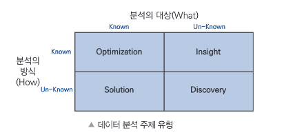 

- 목표 시점에 따른 분류
    - 단기적 접근 방식(**과제 중심적** 접근) : 빠르게 해결하기 위한 목적
    - 중장기적 접근 방식(**마스터 플랜** 접근) : 전사적-장기적 관점에서 과제를 도출 및 수행.
    - 혼합방식(분석 기획시 적합) : 마스터플랜 수립하고 장기적 관점에서 접근. 이해관계자들의 동의를 얻기 위해 과제를 빠르게 해결하여 증명.

 

#### 3) 데이터 분석 유형

- **설명 분석** : 가장 기본 분석. 데이터 요약 또는 집계 결과 도출. 발생한 사실 그 자체를 설명.
- **예측 분석** : 예측 및 가능성을 파악하기 위하여 사용하는 분석.
- **진단 분석** : 데이터간 인과 관계 또는 상관 관계를 파악하여 문제의 원인을 밝히기 위한 분석.
- **처방 분석** : 예측되는 상황을 위해 대안 제시. 대안도출, 의사결정, 일부 실행까지 진행하는 분석. 

  

### 3.분석 마스터 플랜과 로드맵 설정

#### 1) 분석 마스터 플랜

- **분석 마스터 플랜** : 분석 과제의 목적이나 목표에 따라 전체적인 방향성을 제시하는 기본계획.

- <u>분석 마스터 플랜 수립 절차</u>
    - 일반 정보전략계획 방법론을 활용할 수 있다. 다만 데이터 분석 기획의 특성을 고려하여 수행.
    - 과제 도출 방법을 활용하여 데이터 분석 과제들을 빠짐없이 정의.
    - 분석 과제의 중요도와 난이도 등을 고려하여 우선순위 설정.
    - 단기와 중장기로 나누어 분석 로드맵 수립.

- **정보전략계획(ISP: Information Strategy Planning)**
    - '정보기술 및 시스템을 전략적으로 활용' 을 위한 중장기 마스터 플랜 수립 절차.

 

#### 2) 분석과제 우선순위 선정 및 조정

  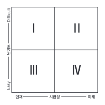 

- 매트릭스 내 분석과제 우선순위 선정
    - **시급성**을 적용 우선순위 기준으로 설정 : 3 > 4 > 1 > 2
    - **난이도**를 적용 우선순위 기준으로 설정 : 3 > 1 > 4 > 2

 

- 매트리스 내 분석과제 우선순위 조정
    - 1사분면은 의사결정을 통해 적용 우선순위를 조정 가능.
 

- 분석 과제 우선순위 조정 시 고려사항
    - 기술적 요소에 따른 적용 우선순위 조정
        - 대용량 데이터 분석은 새로운 기술 요소들로 인하여 기존 운영중인 시스템에 영향이 있을 수 있음.  기존 시스템에 미치는 영향을 최소화 하거나, 운영중인 시스템과 별도로 시행하여 난이도 조율을 통한 우선순위 조정.
    - 분석 범위에 따른 우선순위 조정
        - 분석과제 전체 범위 일괄적으로 적용 및 추진
        - 분석과제 일부만 PoC로 진행 후 범위 확대

 

#### 3) 분석 로드맵 설정

**분석 로드맵** : **마스터 플랜**에서 정의한 목표를 기반으로 분석을 수행하기 위해 필요한 기준 등을 담아 만든 종합적인 계획.

- 분석 로드맵 수립절차
    - 최종적인 실행 우선순위를 결정하여 단계적 구현 로드맵 수립.
    - 단계별 추진하고자 하는 목표를 명확하게 정의.
    - 추진 과제별 선행관계를 고려하여 추진내용 정렬.

 

- 세부적인 일정계획 수립
    - 데이터 수집 및 확보와 분석 데이터 준비 단계는 순차적으로 진행하고 모델링 단계는 반복적으로 수행.
    - 주로 순차형과 반복형을 혼합하여 사용.

  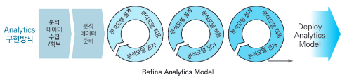 

  

### 4.분석 문제 정의

#### 1) 분석 문제 정의 개요

해결해야 할 다양한 문제들을 데이터 분석 문제로 변환하여 분석 프로젝트로 수행할 수 있는 **과제정의서** 형태로 도출.

 

  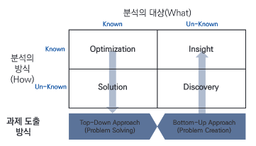 

- 분석 과제 도출 방법
    - **하향식 접근 방식** : 문제가 먼저 주어지고 이에대한 해법 탐색
    - **상향식 접근 방식** : 데이터 기반으로 문제의 재정의 및 해결방안 탐색

 

  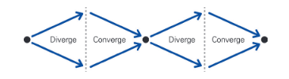 
  

    <b>상향식 접근 방식</b>의 <b>발산(Diverge)</b> 단계 : 가능한 옵션을 도출 
    <b>하향식 접근 방식</b>의 <b>수렴(Converge)</b> 단계 : 도출된 옵션을 분석하고 검증
  

- 발산과 수렴 단계를 반복적으로 수행하며 상호 보환을 통해 분석의 가치를 극대화할 수 있다.

 

#### 2) 하향식 접근 방식(Top Down Approach)

문제가 주어지고 이에 대한 해법을 찾기 위해 각 과정이 체계적으로 단계화되어 수행하는 방식.

    <b>문제 탐색 > 문제 정의 > 해결방안 탐색 > 타당성 평가</b>

 

- **문제 탐색(Problem Discovery)** 단계
    - 전체적인 관점의 기준 모델을 활용하여 누락없이 문제를 도출하고 식별해야한다.
    - 문제 탐색시 세부적인 내용보다 문제 해결시 발생하는 가치에 중심을 두어야 한다.
    - **비즈니스 모델 기반 문제 탐색** 
        - 해당 기업의 비즈니스 모델 캔버스의 블록을 단순화 하여 기회를 도출 (새로운 관점의 접근으로 새로운 유형의 분석 기회와 주제 발굴)
    - **외부 참조 모델 기반 문제 탐색**
        - 유사 또는 동종 환경에서 기존에 수행한 분석사례를 벤치마킹. 
        - 후보 그룹을 통해 빠르고 쉬운(Quick & Easy) 방식으로 접근.
    - **분석 유스케이스** 정의 : 도출한 분석 기회들을 구체적인 과제로 만들기전 분석 유스케이스로 정의. 향후 데이터 분석 문제로의 전환 및 적합성 평가에 활용.

 

  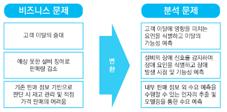 
  <b>문제 정의</b>

- **문제 정의(Problem Definition)** 단계
    - 식별된 비즈니스 문제를 데이터적인 문제로 변환하여 정의.
    - 문제 해결 시 효용을 얻을 최종 사용자 관점에서 정의.
    - 필요한 데이터의 정의나 기법 발굴이 용의하도록, 분석 관점으로 가능한 정확하게 문제를 재정의.

 

- **해결방안 탐색(Solution Search)** 단계
    - **분석 기법 및 시스템** 과 **역량 보유 여부**에 따라 세분화 가능. 다양한 방법 모색.

<table>
    <tr>
        <th rowspan="2"></th>
        <th rowspan="2"></th>
        <th colspan="2" style="text-align: center;">분석역량</th>
    </tr>
    <tr>
        <th style="text-align: center;">확보</th>
        <th style="text-align: center;">미확보</th>
    </tr>
    <tr>
        <th rowspan="2" style="vertical-align: middle; text-align: center;">분석기법 및 시스템</th>
        <th style="text-align: center;">기존 시스템</th>
        <td>기존 시스템 개선 활용</td>
        <td>교육 및 채용을 통한 역량 확보</td>
    </tr>
    <tr>
        <th style="text-align: center;">신규도입</th>
        <td>시스템 고도화</td>
        <td>전문 업체 Sourcing</td>
    </tr>
</table>

 

- **타당성 평가(Feasibility Study)** 단계
    - 도출된 분석 문제, 가설에 대한 대안을 과제화 하기 위한 타당성을 분석.
    - 도출된 여러 대안 중 평가 과정을 거쳐 가장 우월한 대안 선택.
    - **경제적 타당성** : 비용 대비 편익 분석 관점 타당성 평가.
    - **데이터 및 기술적 타당성** : 데이터&분석시스템 환경 분석역량, 역량확보 방안 타당성 평가.

 

#### 3) 하향식 접근 방식의 문제 탐색 방법

  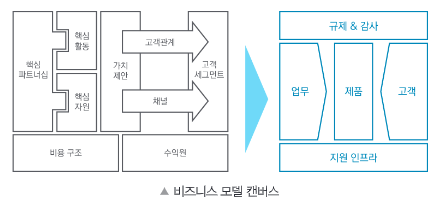 

- 비즈니스 모델 캔버스를 활용한 과제 발굴
    - 비즈니스 모델 캔버스의 9가지 블록을 단순화 하여 5개의 영역으로 도출.(문제 발굴을 3개 + 문제를 관리하는 2개)

 

  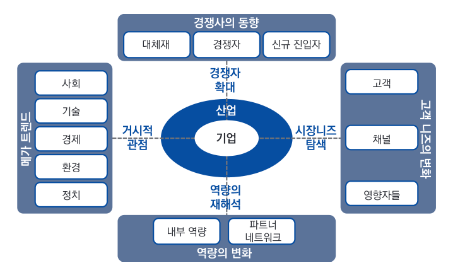 

- 분석 기회 발굴의 범위 확장 : 새로운 문제 발굴, 장기적 접근을 위해 새로운 관점에서의 접근이 필요.
    - 거시적 관점
        - 사회 영역 : 고객 영역을 확장. 전체 시장을 사회,문화,구조적 트렌드 변화에 기반하여 분석 기회 도출
        - 기술 영역 : 최신 기술 등장 변화에 따른 역량 내재화 와 제품 및 서비스 개발에 대한 분석 기회 도출
        - 경제 영역 : 산업,금융의 변동성과 경제 구조 변화에 따른 시장 흐름 파악 및 분석 기회 도출
        - 환경 영역 : 환경과 관련된 규제 및 관심 동향을 파악하고 분석 기회 도출
        - 정치 영역 : 정치적 흐름을 토대로 분석 기회 도출
    - 경쟁자 확대 관점
        - 대체재 영역 : 현재 상품의 대체제를 파악하고 이를 고려한 분석 기회 도출
        - 경쟁자 영역 : 현재 상품의 경쟁 제품의 동향을 파악하고 이를 고려한 분석 기회 도출
        - 신규 진입자 영역 : 향후 시장에 신규 진입할 상품의 동향을 파악하고 이를 고려한 분석 기회 도출
    - 시장의 니즈 탐색 관점
        - 고객 영역 : 고객의 니즈를 파악하여 상품 개전에 필요한 분석 기회 도출
        - 채널 영역 : 상품이 고객에게 전달되는 경로를 파악하여 경로별 분석 기회 도출
        - 영향자들 영역 : 이해 관계자들의 주요 관심사항에 대해 파악하여 분석 기회 도출
    - 역량 재해석 관점
        - 내부 역량 영역 : 내부적으로 갖고 있는 기술,자산에 대해 재해석 하고 분석 기회 도출
        - 파트너와 네트워크 영역 :관계사의 역량을 파악하고 이를 통한 분석 기회 도출

 

#### 4) 상향식 접근 방식(Bottom Up Approach)

다량의 데이터 분석을 통해 왜 그러한 일이 발생하는지 역으로 추적하면서 문제를 도출하거나 재정의할 수 있는 방식.

- <u>상향식 접근 방식의 등장배경</u>
    - 기존 하향식 접근 방식의 한계(문제탐색의 어려움)를 극복하기 위해 등장.

 

- <u>상향식 접근기반 전통적 분석 사고 극복방안</u>
    - 디자인 사고 접근법
        - '현장 관찰' 과 '감정이입','대상 관점'으로의 전환을 수행. (첫 단계로 감정이입 특히 강조)
        - 일발적으로 분석적으로 사물을 인시갛려는 why 강조 대신, 답을 미리 내지 않고 사물을 있는 그대로 인식하는 what 관점으로 접근.
        - 객관적으로 존재하는 데이터 자체를 관찰하고 실제 행동으로 옮김으로써 대상을 더 잘 이해하는 방식으로 접근. 
    - 비지도학습 방법에 의한 수행
        - 목표값을 사전에 학습 및 정의하지 않고 데이터 자체만을 가지고 결과 도출
        - 새로운 유형의 인사이트를 도출하기에 유용한 방식.
        - ex. 데이터 마이닝의 연관규칙분석, 군집분석, 기술통계 및 프로파일링 등...
    - 빅데이터 환경에서의 분석
        - 인과관계에서 상관관계 분석으로 이동.
        - 통계적 분석환경에서는 인과관계 분석을 위해 가설설정하고 이를 검증을 하기위해 모집단으로부터 표본을 추출하여 가설검증

 

#### 5) 상향식 접근 방식의 문제 해결 방법

- **프로토타이핑 접근법** : 일단 순석을 먼저 시도해 보고 그 결과를 확인하면서 반복적으로 개선해 나가는 방식.

 

- 각 **관점**에 대한 프로토타이핑 접근법의 필요성
    - **문제에 대한 인식 수준 관점** 
        - 문제 정의가 불명확하거나 새로운 문제일 경우, 프로토 타입을 통해 문제 이해 및 구체화.
    - **필요 데이터 존재 여부의 불확실성 관점** 
        - 대체 불가능한 데이터가 존재하는 사전에 확인하여 프로젝트가 중도에 중단되는 위험 방지.
    - **데이터 사용 목적의 가변성 관점** 
        - 기존에 보유중인 데이터도 데이터 정의를 재검토하여 데이터 사용 목적과 범위를 재설정 가능.

 

- 프로토타이핑 접근법의 프로세스
    - <b>가설생성 > 디자인에 대한 실험 > 실제 환경에서의 테스트 > 테스트 결과에서의 통찰 도출 및 가설 확인</b>
    - 빅데이터 분석환경에서는 최대한 빨리 분석 결과를 보여주고 이를 가지고 지속적으로 반복하는 방법이 효과적.

  

### 5.데이터 분석 방안

#### 1) 분석 방법론

데이터 분석을 효과적으로 수행하기 위해 분석 절차를 체계적으로 정리한 방법. 일반적으로 **계층적 프로세스 모델**로 구성가능(단계, 태스크, 스텝 - 3계층 구성)

- 분석 방법론의 구성요건
    - 상세한 절차
    - 방법
    - 도구와 기법
    - 템플릿과 산출물
    - 어느 정도 지식만 있으면 활용 가능한 수준의 난이도

 

  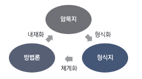 

- 분석 방법론의 생성과정(선순환 과정)
    - **형식화** : 분석가의 경험을 바탕으로 정리하여 문서화
    - **체계화** : 정리된 문서를 바탕으로 방법론 생성
    - **내재화** : 전파된 방법론을 학습하고 활용하여 내재화

  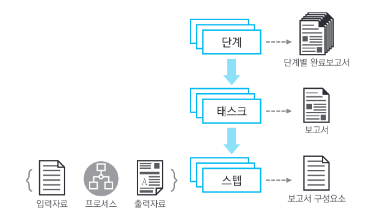 

 

- 계층적 프로세스 모델 구성 (일반적인 분석 방법론 구성 방식)
    - 최상위 계층 - 단계(Phase)
        - 프로세스 그룹을 통하여 완성된 '단계별 완료보고서(산출물)' 생성
        - 각 단계는 기준선으로 설정되어 관리. 버전관리 등을 통하여 통제.
    - 중간 계층 - 태스크(Task)
        - 단계를 구성하는 단위 활동.
        - 물리적 또는 논리적 단위로 품질검토 가능.
    - 최하위 계층 - 스텝(Step)
        - 태스크를 구성하는 단위 활동.
        - 입력자료, 처리 및 도구, 출력자료로 구성된 단위 프로세스.

 

#### 2) 소프트웨어개발생명주기 활용

분석 방법론은 소프트웨어개발생명주기를 활용하여 구성 할 수도 있다.

- 소프트웨어개발생명주기 모형 선정 기준
    - 프로젝트의 규모와 성격
    - 개발에 사용되는 방법과 도구
    - 개발에 소요되는 시간과 비용
    - 개발과정에서의 통제수단과 소프트웨어 산출물 인도 방식

 

- **폭포수 모형**
    - 고전적 소프트웨어개발생명주기
    - 결과물이 후반부에 가서야 구체화 되므로 문제점이 뒤늦게 발견됨.
    - **장점**
        - 이해하기 쉽고 관리 용이
    - **단점**
        - 요구사항 도출 어려움
        - 개발이 늦어짐
        - 문제점 발견이 늦어짐

 

- **프로토타입 모형**
    - 시스템의 일부분을 일시적으로 간략히 구현한 다음 다시 요구사항을 반영하는 과정을 반복.
    - **실험적 프로토타입** : 소프트웨어의 일부분을 개발하여 의사소통의 도구로 활용. 요구분석의 도구로 활용.
    - **진화적 프로토타입** : 이미 개발된 프로토타입을 지속적으로 발전시켜 최종 소프트웨어로 발전.
    - **장점**
        - 시스템을 이해하기 쉽고 요구사항 도출 용이
        - 의사소통 향상 
    - **단점**
        - 폐기되는 프로토타입 존재 (폐기시 많은 노력이 물거품)
        - 프로토 타입을 갖고 소통하므로 완제품에 대한 오해가 생길 수 있음.

 

- **나선형 모형**
    - 시스템을 개발하면서 생기는 위험을 최소화하기 나선을 돌면서 점진적으로 완벽한 시스템으로 개발하는 모형.
    - **장점**
        - 위험 감소, 유지보수 용이.
    - **단점**
        - 관리가 어렵고 개발이 장기화될 가능성이 있다.

 

- **반복적 모형**
    - 제품의 일부분을 반복적으로 개발하여 최종시스템으로 완성하는 모형.
    - 폭포수, 프로토타입, 나선형이 혼함된 모형.
    - **증분형 모형**
        - 폭포수 모형의 변형으로 각 증분(요구사항)을 따로 개발하여 통합
        - **장점**
            - 개발기간 단축
        - **단점**
            - 증분의 수가 많고 병행개발이 빈번하다면 관리가 어려워지고 조율에 많은 노력이 필요.
    - **진화형 모형**
        - 시스템의 요구사항을 사전에 정의하기 어려운 경우 사용.
        - 시스템의 여러 핵심 요소를 개발 한 후 각 구성요소를 지속적으로 발전시켜 나가는 방법.
        - 프로토 타입을 만들고 이를 다시 분석하여 요구사항을 진화시키는 방법.
        - **단점**
            - 다음단계로의 진화를 위해 전체 과정에 대한 개요가 필요.

 

#### 3) KDD(Knowledge Discovery in Database) 분석 방법론

1996년 Fayyad가 통계적인 패턴이나 지식을 탐색하는데 활용할 수 있도록 체계적으로 정리한 **프로파일링 기술 기반**의 데이터 마이닝 프로세스.

- KDD 분석 방법론의 9가지 프로세스
    1. 분석 대상 도메인 이해
    2. 분석 대상 데이터셋 선택 및 생성 (**데이터 선택**)
    3. 데이터에 포함되어있는 잡음(Noise)과 이상값(Outlier) 제거 (**데이터 전처리**)
    4. 분석 목적에 맞는 변수 찾음. 필요시 데이터 차원 변경. (**데이터 변환**)
    5. 분석 목적에 맞는 데이터 마이닝 기법 선택
    6. 분석 목적에 맞는 데이터 마이닝 알고리즘 선택
    7. 데이터 마이닝 시행 (**데이터 마이닝**)
    8. 데이터 마이닝 결과에 대한 해석 (**데이터 마이닝 결과 평가**)
    9. 데이터 마이닝에서 발견된 지식 활용

 

- KDD 분석 방법론의 분석절차(5단계)
    - <b>데이터 선택 > 데이터 전처리 > 데이터 변환 > 데이터 마이닝 > 데이터 마이닝 결과 평가</b>

 

#### 4) CRISP-DM(Cross Industry Standard Process for Data Mining) 분석 방법론

계층적 프로세스 모델로써 4계층으로 구성된 데이터 마이닝 프로세스.

 

  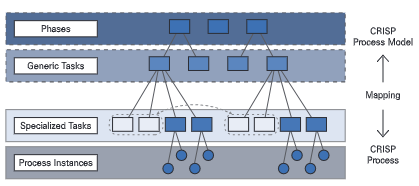 

- CRISP-DM 분석 방법론의 4계층
    - 최상위 레벨 : 여러개의 단계(Phases)로 구성
    - 일반화 태스크(Generic Tasks) : 데이터 마이닝의 단일 프로세스를 완전하게 수행하는 단위.
    - 세분화 태스크(Specialized Tasks) : 일반화 태스크를 구체적으로 수행.
    - 프로세스 실행(Process Instances) : 데이터 마이닝을 구체적으로 수행.

 

  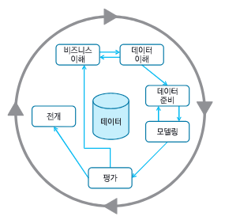 

- CRISP-DM 분석 방법론의 분석절차(6단계)
    - 업무 이해(Business Understanding) 
    - 데이터 이해(Data Understanding)
    - 데이터 준비(Data Preparation)
    - 모델링(Modeling)
    - 평가(Evaluation)
    - 전개(Deployment)

 

- CRISP-DM 과 KDD 분석 방법론 비교

<table>
    <tr>
        <th>CRIP-DM 분석 방법론</th>
        <th>KDD 분석 방법론</th>
    </tr>
    <tr>
        <td>업무 이해</td>
        <td>-</td>
    </tr>
    <tr>
        <td rowspan=2>데이터 이해</td>
        <td>데이터 선택</td>
    </tr>
    <tr>
        <td>데이터 전처리</td>
    </tr>
    <tr>
        <td>데이터 준비</td>
        <td>데이터 변환</td>
    </tr>
    <tr>
        <td>모델링</td>
        <td>데이터 마이닝</td>
    </tr>
    <tr>
        <td>평가</td>
        <td>데이터 마이닝 결과 평가</td>
    </tr>
    <tr>
        <td>전개</td>
        <td>-</td>
    </tr>
</table>

 

#### 5) SEMMA(Sample, Explore, Modify, Model and Assess) 분석 방법론
SAS Institute의 주도로 만들어진 기술과 통계 중심의 데이터 마이닝 프로세스. 주로 데이터 마이닝 프로젝트의 모델링 작업에 중점을 둠.

  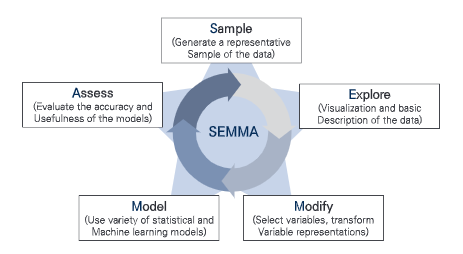 

 

- SEMMA 분석 방법론의 분석절차(5단계)
    - 추출
    - 탐색
    - 수정
    - 모델링
    - 평가

  

### 6. 빅데이터 분석 방법론

각 개별 절차(단계) 별로 세부 태스크와 스텝이 정의. (3계층 구성)

#### 1) 빅데이터 분석 방법론의 개발절차

    <b>분석기획 > 데이터 준비 > 데이터 분석 > 시스템 구현 > 평가 및 전개</b>

 

- **분석 기획(Planning)**
    - 비즈니스 이해 및 범위 설정
    - 프로젝트 정의 및 계획 수립
    - 프로젝트 위험 계획 수립

 

- **데이터 준비(Preparing)**
    - 필요 데이터 정의
    - 데이터 스토어 설계
    - 데이터 수집 및 정합성 점검

 

- **데이터 분석(Analyzing)**
    - 분석용 데이터 준비
    - 텍스트 분석
    - 탐색적 분석
    - 모델링
    - 모델 평가 및 검증

 

- **시스템 구현(Developing)**
    - 설계 및 구현
    - 시스템 테스트 및 운영

 

- **평가 및 전개(Deploying)**
    - 모델 발전계획 수립
    - 프로젝트 평가 및 보고

  

### 7. 데이터 분석 거버넌스

- **거버넌스** : 업무 프로세스, 정책 및 정보를 만들고 관리하는 지속적인 프로세스

#### 1) 데이터 분석 거버넌스

- 데이터 분석 거버넌스의 구성요소
    - 데이터 분석 기획 및 관리 수행 **조직**
    - 데이터 분석 과제 기획과 운영 **프로세스**
    - 데이터 분석 지원 **인프라**
    - **데이터 거버넌스**
    - 데이터 분석 교육 및 마인드 **육성체계**

 

#### 2) 데이터 분석 기획 및 관리 수행 조직
*빅데이터 조직 및 인력 참고
- 집중형 조직구조
- 기능형 조직구조
- 분산형 조직구조

 

#### 3) 데이터 분석 지원 인프라

- 데이터 분석 플랫폼 : 데이터 분석 서비스를 위한 컴퓨터 시스템

- 데이터 분석 플랫폼 구축
    - 데이터 분석 마스터 플랜을 기획하는 단계에서부터 장기적, 지속적, 안정적으로 활용 할 수 있도록 고려
    - 단기적으로 구축하기 쉬운 개별 시스템 보다 확장성을 고려한 플랫폼 구조 도입이 적절

- **데이터 분석 플랫폼의 구성요소**

  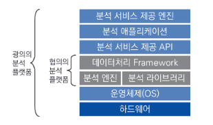 

 

#### 4) 데이터 거버넌스
전사 차원의 모드 데이터에 대해 표준화된 관리 체계를 수립하고 운영하기 위한 프레임 워크와 저장소를 구축하는것.

- 데이터 거버넌스의 주요 관리 대상
    - 마스터 데이터(Master Data) : 데이터를 처리 및 조작하기 위하여 사용되는 기본 데이터
    - 메타 데이터(Meta Data) : 다른 데이터를 설명하기 위해 사용되는 데이터
    - 데이터 사전(Data Dictionary) : 효과적인 데이터 자원관리를 위해 자료의 이름, 표현방식, 의미, 사용방식, 다른 자료와의 관계 등을 저장해놓은 데이터.

 

- 데이터 거버넌스의 구성요소
    - 원칙
        - 데이터 유지관리 지침 및 가이드
    - 조직
        - 데이터 관리할 조직 구성원(사람)
    - 프로세스
        - 데이터 관리를 위한 활동

  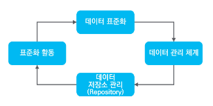 

 

- 데이터 거버넌스의 체계
    - 데이터 표준화
        - 데이터 표준 용어 설정, 명명규칙 수립
        - 메타 데이터 및 데이터 사전 구축
    - 데이터 관리 체계
        - 데이터 사전 관리 원칙 수립 및 항목별 상세 프로세스 수립.
        - 빅데이터의 경우 데이터 생명주기 관리방안도 수립해야함.
    - 데이터 저장소 관리
        - 데이터 관리를 위한 저장소 구성
        - 관리 대상 시스템과의 인터페이스를 통한 통제가 가능해야 함
        - 데이터 구조 변경시 사전 영향 평가 등을 수행해야 함
    - 표준화 활동
        - 데이터 거버넌스 체계 구축 후 주기적으로 표준 준수 여부, 개선 활동, 정기교육 등 점검

  

### 8. 데이터 분석 수준진단

#### 1) 분석 수준 진단 프레임 워크
6개 영역의 분석준비도와 3개 영역의 분석 성숙도를 동시에 평가 할 수 있다.

  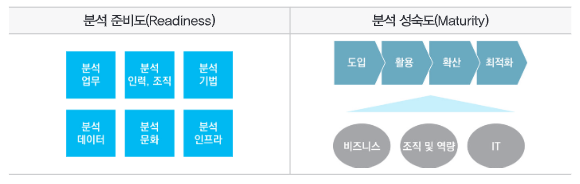 

 

#### 2) 분석 준비도(Readiness)
데이터를 분석하여 업무 및 의사결정에 활용하기 위한 준비가 어느정도 되어있는지 점검하는 체계

- 총 6가지 영역을 대상으로 현재 수준을 파악(세부 항목에 대한 수준까지 파악)
- 전체 요건중 일정 수준 이상 충족하며 데이터 분석 업무를 도입
- 만일 일정 수준 이상 충족되지 못하면 데이터 분석 환경을 먼저 조성

 

#### 3) 분석 성숙도 
데이터 분석 능력 및 분석 결과 활용에 대한 조직의 성숙도 수준을 평가하여 현재 상태를 점검하는 체계

- 성숙도 수준에 따라 도입, 활용, 확산, 최적화 단계로 구분
- 각 단계 마다 비즈니스 부문, 조직 및 역량 부문, IT 부문 총 3개 부문을 대상으로 평가 실시

 

#### 4) 분석 수준 진단 결과

  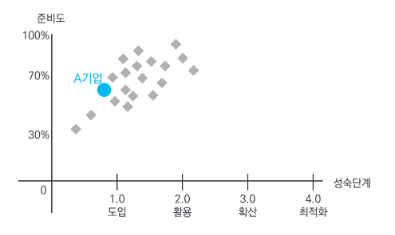 

- 조직의 현재 데이터 분석 수준을 객관적으로 파악할 수 있다. 타사의 데이터 분석 수준과 비교하여 목표 수준 설정이 가능.

 

  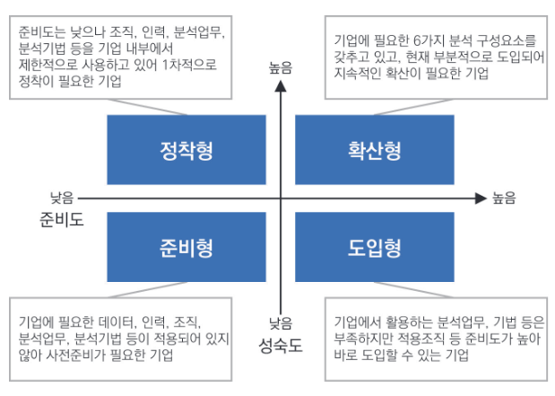 

- **사분면 분석**
    - 데이터 분석 관점에서 4가지 유형으로 분석 수준 진단 결과를 구분
    - 향후 데이터 분석 수준에 대한 목표나 방향을 정의
    - 유형별 특성에 따라 개선방안 수립
