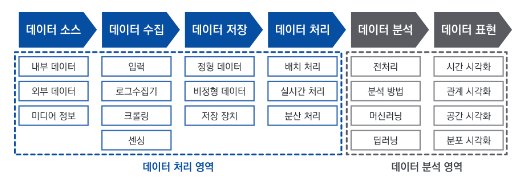
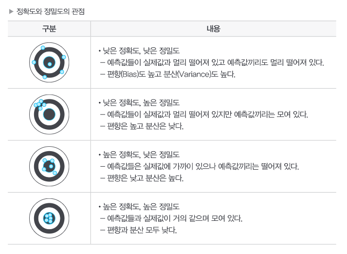

# 데이터 분석 계획

## 분석 작업 계획

### 1. 분석 작업 개요

   

분석 작업 계획을 수립하기 위해 데이터 처리 프로세스 전체에 대한 이해가 필요.
데이터 처리 영역과 데이터 분석 영역으로 나누어 살펴볼 수 있다.

#### 1) 데이터 처리 영역
데이터 분석을 위한 환경을 제공하는 영역
- 데이터 소스
- 데이터 수집
- 데이터 저장
- 데이터 처리

 

#### 2) 데이터 분석 영역
저장되어 있는 데이터를 추출하여 분석 목적과 방법에 맞게 가공한 후 데이터 분석을 직접 수행하고 결과를 표현하는 영역
- 데이터 분석
- 데이터 표현

  

### 2. 데이터 확보 계획

#### 1) 데이터 확보를 위한 사전 검토사항

- 필요 데이터 정의
    - 필요 데이터 정의 및 확보여부 확인
    - 확보할 수 없다면 대안 고려

 

- 보유 데이터의 현황 파악
    - 정의한 데이터의 존재 여부와 해당 데이터가 최신성을 보장하는지 확인
    - 품질, 양 충분한지 확인

 

- 분석 데이터의 유형
    - 어떤 데이터를 어떤 기법을 활용하여 분석할 건지 선택

 

- 편향되지 않고 충분한 양의 데이터 규모
    - 데이터를 train, validation, test 데이터셋으로 나눌 수 있을정도로 충분히 확보

 

- 내부 데이터의 사용
    - 개인정보일 경우 비식별 조치방안 함께 고려

 

- 외부 데이터의 수집

 

- 데이터 수집 방법
    - 설문조사
    - 관찰
    - 실험
    - 웹 크롤링
    - 소셜 미디어 분석
    - FGI(Focused Group Interview, 집단면접)
    - 스크래퍼

 

#### 2) 분석에 필요한 변수 정의
- 데이터 수집 기획
- 분석 변수 정의

 

#### 3) 분석 변수 생성 프로세스 정의
- 객관적 사실 기반의 문제 접근
- 데이터의 상관 분석
- 프로토타입을 통한 분석 변수 접근

 

#### 4) 생성된 분석 변수의 정제를 위한 점검항목 정의
도출된 데이터에 대해 가용성을 평가하고 점검항목을 정의
- 데이터 수집
    - 데이터 적정성
    - 데이터 가용성
    - 대체 분석 데이터 유무

 

- 데이터 적합성
    - 데이터 중복
    - 분석 변수별 범위
    - 분석 변수별 연관성
    - 데이터 내구성

 

- 특징 변수
    - 특징 변수 사용
    - 변수 간 결합 가능 여부

 

- 타당성
    - 편익/비용 검증
    - 기술적 타당성

 

#### 5) 생성된 분석 변수의 전처리 방법 수립
- 데이터 전처리 방법 수립
    - 데이터 정제
    - 데이터 통합
    - 데이터 축소
    - 데이터 변환

 

#### 6) 생성 변수의 검증 방안 수립

  

### 3. 분석 절차와 작업 계획

#### 1) 분석절차
- 분석 방법론을 구성하는 최소 요건
- 상황에 따라 단계를 추가 또는 생략 가능
- **일반적인 분석 절차**
    - 문제인식 > 연구조사 > 모형화 > 데이터 수집 > 데이터 분석 > 분석 결과 제시
- **분석 절차 적용 시 고려사항**
    - 문제에 대해 구체적 정의 가능, 필요데이터 보유, 분석역량 보유 -> 통계기반 전통적 데이터 분석 수행 가능
    - 문제에 대해 구체적 정의 없음 -> 데이터 마이닝 기반으로 데이터 분석 하여 인사이트 도출 또는 반복적으로 데이터 분석을 시도하며 개선 결과 도출

 

#### 2) 분석 작업 계획
분석 절차에 따라 분석 업무를 수행하기 위한 전반적인 작업 내용들을 세부적으로 정의하는 과정

- 분석 작업 계획 수립
    - 프로젝트 소요비용 배분
    - 프로젝트 작업분할구조 수립
    - 프로젝트 업무 분장 계획 및 배분

 

- 분석 작업계획 수립을 위한 작업분할구조(WBS: Work Breakdown Structure) 작성

    > **작업분할구조** : 프로젝트의 범위와 최종 산출물을 세부요소로 분할한 계층적 구조도

 

#### 3) 분석목표정의서
문제의 개선방향에 맞는 현실적인 분석목표를 수립하여 필요 데이터에 대한 정보, 분석 타당성 검토, 성과측정 방법 등을 정리한 정의서.

- 분석목표 정의서 구성요소
    - 원천 데이터 조사
    - 분석 방안 및 적용 가능성 판단
    - 성과평가 기준

  

### 4. 분석 프로젝트 관리

#### 1) 분석 프로젝트
과제 형태로 도출된 분석 기회를 프로젝트화 하여 그 가치를 증명하기 위한 수단

- **분석 프로젝트** 에서 **추가적인 중점 관리 영역**
    - **데이터 크기**
        - 데이터가 지속적으로 증가하는 점 고려
    - **데이터 복잡도**
        - 정형,비정형 데이터 그리고 다양한 시스템에 있는 데이터 통합 진행 필요
        - 데이터에 잘 적용 될 수 있는 분석모형 선정 고려
    - **속도**
        - 분석 모형의 성능과 속도
    - **분석 모형 복잡도**
        - 분석 모형의 정확도와 복잡도는 Trade off 관계
        - 분석 모형이 복잡할수록 정확도 상승. but 해석이 어려워짐
    - **정확도와 정밀도**
        - 분석 결과 활용 측면에서는 정확도가 중요
        - 분석 모형 안정성 측면에서는 정밀도가 중요
        - 정확도와 정밀도는 Trade off 관계인경우가 많다.

> **정확도(Accuracy)** : 측정값과 실제값과 차이 
> **정밀도(Precision)** : 같은 측정을 할때 결과의 일관성

   

 

#### 2) 분석 프로젝트 관리
- 데이터 분석이 갖는 기본특성(5V)을 살려 프로젝ㅌ 관리 지침을 만들어 기본 가이드로 활용해야 함
- 주요사항은 체크포인트 형태로 관리 되어야 함

 

#### 3) 분석 프로젝트의 영역별 주요 관리 항목
- 범위 관리
- 일정 관리
- 원가 관리
- 품질 관리
- 통합 관리
- 조달 관리
- 인적자원 관리
- 위험 관리
- 의사소통 관리
- 이해관계자 관리
