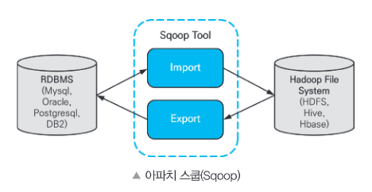
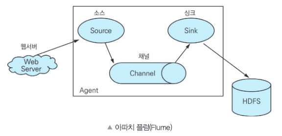
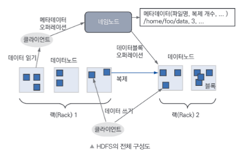
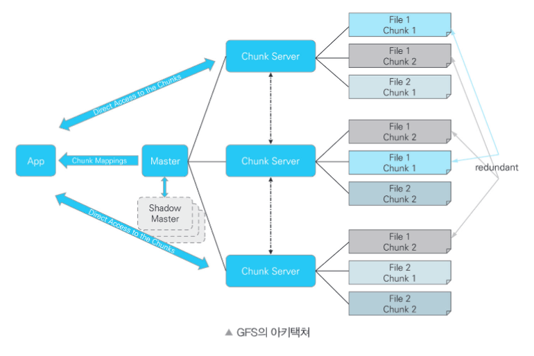

# 데이터 수집 및 저장 계획

## 데이터 수집 및 전환

### 1. 데이터 수집

#### 1) 비즈니스 도메인과 원천 데이터 정보 수집

- **비즈니스 도메인 정보**
    - 비즈니스 모델
    - 비즈니스 용어집
    - 비즈니스 프로세스
    - 도메인 전문가 인터뷰

 

- **원천 데이터 정보**
    - 데이터의 수집 가능성(수집 용이성 등...)
    - 데이터 보안
    - 데이터 정확성
    - 수집 난이도
    - 수집 비용

 

#### 2) 내. 외부 데이터 수집

- **내부 데이터** ← 인터페이스를 통해 실시간으로 수집
    - 서비스 시스템
    - 네트워크 및 서버 장비
    - 마케팅 데이터

 

- **외부 데이터** ← 인터넷을 통해 일정 주기로 데이터 수집
    - 소셜 데이터
    - 특정 기관 데이터
    - M2M 데이터
    - LOD(Linked Open Data) : 웹에서 누구나 사용할 수 있도록 무료로 공개되는 연계 데이터

 

#### 3) 데이터 수집 기술

- **정형 데이터**
    - ETL(Extract Transform Load)
    - FTP(File Transfer Protocol) : TCP/IP 나 UDP 프로토콜을 통해 원격지 시스템으로부터 파일을 송수신하는 기술
    - API(Application Programming Interface)
    - DBToDB
    - 스쿱(Sqoop) : 관계형 DB(RDBMS)와 하둡(hadoop) 간 데이터를 전송하는 방법

> <b>FTP</b> 
> - TCP/IP 위에서 동작
> - 서버와 클라이언트를 먼저 연결하고 이후에 데이터 파일을 전송
> - FTP 서비스를 제공하는 서버와 접속하는 클라이언트 사이에 두개의 연결(**데이터 제어 연결**, **데이터 전송 연결**)을 생성.
> - **데이터 제어 연결** : 데이터 전송에 필요한 정보를 처리 
> - **데이터 전송 연결** : 실제 데이터 송수신 작업 처리
> - **특징** : 동작 방식이 단순하고 직관적, 빠른 속도로 많은 파일을 한꺼번에 주고 받을 수 있다.

> **스쿱(Sqoop)**
> 관계형 데이터 스토어 간 대량 데이터를 효과적으로 전송하기 위해 구현된 도구
> - 커넥터를 사용하여 관계형 DB(RDBMS) 데이터를 맵리듀스(Mapreduce)를 통해 하둡 파일시스템(HDFS, Hive, Hbase) 으로 수집
> - 하둡 파일시스템으로 수집된 데이터들을 하둡 맵리듀스(Mapreduce)로 변환하고 다시 관계형 데이터베이스로 내보낼 수 있다.
> - 맵리듀스를 통해 처리하기 때문에 병렬처리 가능
> - **특징** 
>   - Bulk import 지원 : 전체 데이터베이스를 HDFS로 전송가능
>   - 데이터 전송 병렬화
>   - Direct input 제공 : RDB에 매핑하여 Hbase와 Hive에 직접 import 제공
>   - 프로그래밍 방식의 데이터 인터랙션 : 자바 클래스 생성을 통한 데이터 상호작용 지원
> 

>   
> 

 

- **비정형 데이터**
    - 크롤링(Crawling)
    - RSS(Rich Stie Summary) : 웹사이트에 게시된 새로운 글을 공유하기 위해 XML 기반으로 정보를 배포하는 프로토콜
    - Open API
    - 척와(Chukwa) : 분산 시스템으로 데이터를 수집. 하둡 파일시스템에 저장. 실시간으로 분석할 수 있는 기능 제공.
    - 카프카(Kafka) : 대용량 실시간 로그처리를 위한 분산 스트리밍 플랫폼 기술

 

- **반정형 데이터** ← 비정형 데이터 수집 기술도 적용 가능
    - 플럼(Flume) : 분산 환경에서 대량의 로그 데이터를 수집 전송하고 분석하는 기능 제공
    - 스크라이브(Scribe) : 다수의 수집 대상 서버로부터 실시간으로 데이터를 수집. 분산 시스템에 데이터를 저장하는 기능을 제공.
    - 센싱(Sencing) : 센서로부터 수집 및 생성된 데이터를 네트워크를 통해 활요하여 수집하는 기능 제공
    - 스트리밍(Streaming) - TCP,UDP,Bluetooth,RFID : 네트워크를 통해 미디어 데이터를 실시간으로 수집하는 기술

> **플럼(Flume)**
>  대용량의 로그 데이터를 효과적으로 수집, 집계, 이동 시키는 신뢰성 있는 분산 서비스를 제공하는 솔루션
> - 스트리밍(Streaming) 데이터 흐름에 기반을 둔 간단하고 유연한 구조
> - 플럼의 하나의 에이전트는 소스, 채널, 싱크로 구성
>   - **소스** : 웹서버, 로그데이터 서버 등 원시데이터 소스와 연결
>   - **채널** : 큐 구조를 갖음. 소스로 부터 데이터 수신. 싱크로 데이터 송신.
>   - **싱크** : 목표 시스템으로 수신받은 데이터 전달
> - **특징** : 대량의 이벤트 데이터 전송을 위해 사용
>   - 신뢰성 : 장애 시 로그 데이터의 유실 없이 전송을 보장
>   - 확장성 : 수평확장 가능하여 분산수집 가능한 구조
>   - 효율성 : 커스터마이징 가능하며 고성능 제공
> 

>   
> 

> **스크래피(Scrapy)**
> 웹사이트를 크롤링하고 구조화된 데이터를 수집하는 도구
> - API를 이용하여 다양한 형식의 데이터를 추출가능. 범용 웹 크롤러로 사용.
> - **특징**
>   - 파이썬 기반
>   - 단순한 스크랩 과정 : 크롤링 후, 바로 데이터 처리 가능
>   - 다양한 부가 요소 : scrapyd, scrapinghub 등 부가요소, 쉬운 수집, 로깅을 지원

  

### 4. 데이터 비식별화

#### 1) 비식별화 개요

- **식별자(Identifier)** : 개인을 고유하게 식별할 수 있는 정보 (ex. 주민등록번호, 이름, 상세주소 등...)
- **속성자(Attribute value)** : 개인에 대한 추가적인 정보, 다른 정보와 결합하여 특정 개인을 알아볼 수도 있는 정보.(ex. 성별, 혈액형, 학교명 등...)

- <u><b>비식별 조치 방법</b></u>
    - **가명처리**
        - **장점** : 데이터의 변형 또는 변질수준이 낮음
        - **단점** : 대체 값 부여시에도 식별 가능한 고유 속성(속성자)이 계속 유지
        - **- 휴리스틱 가명화** : 식별자에 해당하는 값들을 몇가지 정해진 규칙으로 대체하거나 사람의 판단에 따라 가공하여 비식별 조치.
            - 장점 : 사용자가 쉽게 이해하고 활용 가능
            - 단점 : 활용할 수 있는 대체 변수에 한계가 있음. 다른값으로 대체하는 규칙이 노출되는 취약점 존재. 
        - **- 암호화** : 일정한 규칙의 알고리즘을 적용하여 암호화. 양방향 암호화는 복호화 키에 대한 보안방안 필요. 일방향 암호화는 식별성을 완전히 제거.
        - **교환방법** : 사전에 정해진 외부 변수값과 연계하여 교환(ex. 사용자 ID, 기관 번호)

     

    - **총계처리**
        - **장점** : 민감한 수치 정보에 대하여 비식별 조치가능. 통계분석용 데이터셋 작성이 유리.
        - **단점** : 정밀분석이 어려움. 집계수량이 적을경우 추론에 의한 식별가능성 존재.
        - **- 부분총계** : 데이터셋 내 오차가 큰 범위만 통계값(평균 등...) 으로 대체.
        - **- 라운딩** : 집계 처리된 값에 대하여 라운딩(올림, 내림, 반올림) 기준 적용. (ex. 20대, 30대 등...)
        - **- 재배열** : 기존 정보 값은 유지하면서 개인이 식별되지 않도록 데이터를 재배열하는 방법. 
    
     

    - **데이터 삭제**
        - **장점** : 개인 식별요소의 전부 및 일부 삭제 처리가 가능
        - **단점** : 분석의 다양성과 분석 결과의 유효성,신뢰성이 저하
        - **- 레코드 삭제** : 다른 정보와 뚜렷하게 구별되는 레코드 전체 삭제.(ex. 이상값 제거)
        - **식별요소 전부삭제** : 식별자 뿐 아니라 속성자까지 전부 삭제. 식별 가능성 낮아지지만 필요한 정보까지 삭제되어 데이터 유용성도 낮아짐.

     

    - **데이터 범주화**
        - **장점** : 통계형 데이터 형식으로 다양한 분석 및 가공 가능.
        - **단점** : 정확한 분석결과 도출 어려움. 데이터 범위 구간이 좁혀질 경우 추론 가능성이 존재.
        - **- 감추기** : 명확한 값을 숨기기 위해 평균 또는 범주 값으로 변환.
        - **- 랜덤 라운딩** : 임의의 수 기준으로 올림 또는 내림하는 기법.
        - **- 범위 방법** : 범위 또는 구간으로 표현 (3000~4000만원)
        - **- 제어 라운딩** : 랜덤 라운딩 방법에서 특정값을 변경 할 경우 행과 열의 합이 일치하지 않은 단점을 해결하게 위해 행과 열이 맞지 않는것을 제어하며 일치시키는 기법.

     

    - **데이터 마스킹**
        - **장점** : 개인 식별 요소를 제거하는것이 가능. 원 데이터 구조에 대한 변형이 적음.
        - **단점** : 마스킹을 과도하게 적용 할 경우 데이터를 필요 목적에 활용하기 어려움. 수준이 낮을경우 특정값에 대한 추론 가능.
        - **- 임의 잡음 추가** : 정보에 임의의 숫자 등 잡음을 더하거나 곱하는 방법
        - **- 공백과 대체** : 데이터의 일부 또는 전부를 공배 또는 대체문자로 바꾸는 기법

 

#### 2) 적정성 평가
개인정보 보호 책임자 책임 하에 외부 전문가가 참여하는 '비식별 조치 적정성 평가단'을 구성 하여 엄격한 평가가 필요. **k-익명성**을 최소한의 수단으로 활용하며 필요시 **l-다양성**, **t-근접성**을 활용.

- **프라이버시 보호 모델**
    - **k-익명성** : 특정인임을 추론할 수 있는지 여부를 검토, 일정 확률 수준 이상 비식별 되도록 하는 기법.
        - 주어진 데이터 집합에서 같은 값이 적어도 k개 이상 존재(= 식별될 확률을 1/k)
        - 적정성 평가단은 적절한 k 값을 선택후 평가
        - **k-익명성의 취약점** 
            - 동질성 공격 : 레코드 들이 범주화 되었더라도 상관관계가 있는 독립변수들이 모두 같은 값을 가지는 경우 모든 레코드의 종속변수의 값이 같을것을 알 수 있으므로 정보를 알아 낼 수 있음.
            - 배경지식에 의한 공격 : '여자는 전립선염에 걸릴 수 없으므로' 전립선염에 걸린 사람이 남자라는 것을 알 수 있음.
    - **l-다양성** : 특정인 추론이 안된다고 해도 민감한 정보의 다양성을 높여 추론 가능성을 낮추는 기법.
        - 동질성 공격, 배경지식에 의한 공격을 방어하기 위한 모델
        - 주어진 데이터 집합에서 함께 비식별된 레코드들은 적어도 l개의 서로 다른 정보를 가지도록 한다.
        - **l-다양성의 취약점**
            - 쏠림 공격
            - 유사성 공격
    - **k-근접성** : l-다양성 뿐 아니라, 민감한 정보의 분포를 낮추어 추론 가능성을 더욱 낮추는 기법
        - l-다양성의 취약점을 보완하기 위한 모델
        - 정보의 분포를 조정하여 정보가 특정 값으로 쏠리거나 유사한 값들이 뭉치는 경우를 방지

 

### 5. 데이터 품질 검증

#### 1) 데이터 품질 관리
목표에 부합한 데이터 분석을 위해 가치성, 정확성, 유용성 있는 데이터를 확보하고 신뢰성 있는 데이터를 유지하는데 필요한 관리활동.

- **데이터 품질 관리가 필요한 이유**
    - 분석 결과의 신뢰성 확보
    - 일원화된 프로세스
    - 데이터 활용도 향상
    - 양질의 데이터 확보

 

#### 2) 데이터 품질
- **정형 데이터 품질기준**
    - **완전성** : 필수 항목에 누락이 없어야함
        - 개별 완전성 
        - 조건 완전성
    - **유일성** : 데이터 항목은 유일해야함. 중복X
        - 단독 유일성
        - 조건 유일성 
    - **일관성** : 데이터가 지켜야할 구조, 값, 표현형태가 일관되게 정의되고 서로 일치해야함.
        - 기준코드 일관성
        - 참조 무결성
        - 데이터 흐름 일관성
        - 칼럼 일관성
    - **유효성** : 정해진 데이터 유효범위 및 도메인을 충족
        - 범위 유효성
        - 날짜 유효성
        - 형식 유효성
    - **정확성** : 실세계에 존재하는 개첵의 표현값이 정확히 반영
        - 선후관계 정확성
        - 계산/집계 정확성
        - 최신성
        - 업무규칙 정확성

 

- **비정형 데이터 품질기준**
    - **기능성**
        - 적절성
        - 정확성
        - 상호 운용성
        - 기능 순응성
    - **신뢰성**
        - 성숙성
        - 신뢰 순응성
    - **사용성**
        - 이해성
        - 친밀성
        - 사용 순응성
    - **효율성**
        - 시간 효율성
        - 자원 효율성
        - 효율 순응성
    - **이식성**
        - 적응성
        - 공존성
        - 이식 순응성

 

#### 4) 데이터 품질 진단 절차

    <b>품질 진단 계획 수립 > 품질 기준 및 진단 대상 정의 > 품질 측정 > 품질 측정 결과 분석 > 데이터 품질 개선</b>

 

 

#### 5) 데이터 품질 검증 수행
- '수집 데이터 품질 보증 체계'를 수립, 품질 점검 수행 후 '품질검증 결과서' 작성
- 품질 점검 수행 과정에서 데이터 오류 수정이 용이하지 않을 경우 데이터를 재수집

 
 

## 데이터 적재 및 저장

### 1. 데이터 적재

#### 1) 데이터 적재 도구

- 데이터 수집 도구를 이용한 데이터 적재
    - 플루언티드(Fluentd) : 트레저 데이터(Treasure Data) 에서 개발된 크로스 플랫폼 오픈소스 데이터 수집 소프트웨어. 사용자의 로그를 다양한 형태로 입력받아 JSON 포맷으로 변환한 뒤 다양한 형태로 출력.
    - 플럼(Flume) : 많은 양의 로그 데이터(트래픽 데이터, 소셜미디어 데이터 등 포함)를 효율적으로 수집, 취합, 이동하기 위한 분산형 소프트웨어. 
    - 스크라이브(Scribe) : 수많은 서버로부터 실시간으로 스트리밍 되는 로그 데이터를 집약시키기 위한 서버. 클라이언트 사이드 수정없이 스케일링, 확장 가능.
    - 로그스태시(Logstash) : 다양항 소스에서 데이터를 수집하여 변환한 후 Elasticsearch, kafka, 데이터베이스 등으로 전송하는 데이터 파이프라인 도구
- NoSQL DBMS가 제공하는 도구를 이용한 데이터 적재
    - 로그 수집기를 이용한 방법처럼 많은 기능을 사용 할 수 없음. NoSQL DBMS 의 적제 도구를 사용하여 데이터 적제 수행 가능(ex. mongoimport)
- 관계형 DBMS의 데이터를 NoSQL DBMS에서 적재
    - 데이터 변형이 많이 필요하다면 데이터 적재를 위한 프로그램을 작성하여 적재, 큰 변화없이 적재한다면 SQLtoNoSQLimporter, Mongify 등 도구를 사용하여 적재

 

#### 2) 데이터 적재 완료 테스트
- 데이터 적재 내용에 따라 체크리스트 작성
- 데이터 테스트 케이스 개발
- 체크리스트 검증 및 데이터 테스트 케이스 실행
    - 검증 결과 분석 후 '데이터 적재 결과 보고서' 작성

 

### 2. 데이터 저장

#### 1) 빅데이터 저장시스템
- **파일 시스템 저장방식**
    - 저사양 서버들을 활용하여 대용량, 분산, 데이터 집중형의 애플리케이션 지원을 통해 파일단위로 저장
- **데이터 베이스 저장방식**
    - RDBMS 또는 NoSQL DBMS를 사용하여 저장

 

#### 2) 분산 파일 시스템

   

- **하둡 분산파일 시스템(HDFS: Hadoop Distributed File System)**
    - 마스터 노드(=네임노드) 하나와 여러개의 슬레이브 노드(=데이터노드) 로 구성
    - 대용량 파일을 클러스터에 여러 블록으로 분산저장. 블록들은 마지막 블록을 제외하고는 모두 크기가 동일.
    - 데이터 손상을 방지하기 위해 데이터 복제 기법 사용.

 

> <b>하둡(Hadoop) = 분산파일 시스템(저장) + 맵리듀스(분석)</b> 
>  
> <b>맵리듀스(MapReduce) - 분산 데이터 처리기술</b> 
> - 구글에서 발표한 MapReduce 방법을 하둡 오픈소스 프로젝트에서 구현.
> - 주어진 입력을 여러개의 부분으로 분할, 각각의 부분에 대해 필요한 함수를 적용하여 결과값을 저장(Map 합수와 Reduce 함수로 구성)
> - 분산 병렬 처리 가능

 

   

- **구글 파일 시스템(GFS: Google File System)**
    - 마스터(Master), 청크서버(Chunk Server), 클라이언트로 구성
    - 일반적인 파일 시스템에서 클러스터, 섹터들과 비슷하게 64MB로 고정된 크기의 청크들로 나누어 저장
    - 가격이 저렴한 서버에서도 사용되도록 설계. 안정성 위주의 설계로 응답시간이 조금 길더라도 높은 처리성능에 중점을 둠.

 

#### 3) NoSQL

> <b>CAP 이론</b> 
> - 어떤 시스템이든 일관성(Consistency), 가용성(Availiability), 지속성(Partition Tolerance) 세가지 특성을 동시에 만족하기 어렵다. 세가지중 최대 두가지만 보장 가능하다.
> - **일관성(Consistency)** : 분산 환경에서 모든 노드가 같은 시점에 같은 데이터를 보여줘야한다.
> - **가용성(Availiability)** : 일부 노드가 다운되어도 다른 노드에 영향을 주지 않아야 한다.
> - **지속성(Partition Tolerance)** : 데이터 전송 중에 일부 데이터를 손실하더라도 시스템은 정상 동작해야 한다.

- **CAP 이론을 기준으로 한 RDBMS 와 NoSQL 비교**

|  구분  | 설명  | 적용 예 |
|--------|--------|------------|
| RDBMS | 일관성(C) 와 가용성(A) 보장 | 트랜잭션 ACID 보장(금융 서비스) |
| NoSQL | 일관성(C) 나 가용성(A) 중 하나를 포기. 지속성(P) 보장. | C+P형 : 대용량 분산파일 시스템(성능보장) A+P형 : 비동기식 서비스(아마존,트위터 등) | 

 

- **NoSQL의 기술적 특성**
    - **스키마가 없음** : 스키마 없이 키값을 이용하여 다양한 형태의 데이터 저장 및 접근 가능
    - **탄력성** : 시스템 일부 장애가 발생해도 시스템 접근 가능. 성능확장 용이. 입출력 부하 분산 용이.
    - **질의 기능** : 효율적으로 데이터 검색,처리 할 수 있는 질의언어,기술,api 를 제공
    - **캐싱** : 대규모 질의를 캐싱하여 빠른 응답 가능.

 

- **NoSQL의 데이터모델** - 저장방식에 따라 구분 가능
    - **키-값(Key-Value) 데이터베이스**
        - 가장 간단한 데이터 모델
        - 범위 질의는 사용이 어렵다(DB에서 지원하면 사용 가능)
        - 응용 프로그램 모델링이 복잡
        - **ex) DynamoDB(아마존), Redis**
    - **열기반(칼럼기반, Column-oriented) 데이터베이스**
        - 데이터를 로우가 아닌 칼럼기반으로 저장 및 처리
        - 연관된 데이터 위주로 읽는데 유리한 구조
        - 하나의 레코드를 변경하려면 여러곳을 수정해야 한다.
        - 동일 도메인의 열 값이 연속되므로 압축 효율이 좋다.
        - 범위 질의에 유리
        - **확장성이 보장됨**
        - **ex) Bigtable(구글), Cassandra(아파치), HBase, HyperTable**
    - **문서기반(Document-oriented) 데이터베이스**
        - 문서 형식의 정보를 저장, 검색, 관리하기 위한 데이터 베이스
        - 레코드간 관계 설명이 가능
        - 개념적으로 RDBMS와 비슷
        - **ex) SimpleDB(아마존), CouchDB(아파치), MongoDB**

 

#### 4) 빅데이터 저장시스템 선정을 위한 분석

- **기능성 비교분석** : 아래의 구분에 따라 분석후 알맞은 빅데이터 저장시스템을 선정해야 한다.
    - **데이터 모델**
    - **확장성**
    - **트랜잭션 일관성**
    - **질의 지원**
    - **접근성**

 

#### 5) 데이터 발생 유형 및 특성 
- **대용량 실시간 서비스 데이터 (스트리밍 데이터)** → ex) IoT 에서 발생하는 데이터, 웹로그 등...
    - 대용량 특성과 무중단 서비스를 보장하는 저장체계 구축이 필요.
    - 배치 기반의 대용량 처리에 특화된 하둡 시스템보다 실시간 대용량 데이터 처리에 특화된 스파크(Spark), 스톰(Storm) 사용.

 

- **대용량 실시간 서비스 데이터 저장**
- 스파크(Spark), 스톰(Storm) 은 내장된 저장소를 제공하지 않기 때문에 외부 저장 시스템과의 연계가 필수적.

 

#### 6) 안정성과 신뢰성 확보 및 접근성 제어계획 수립
- 빅데이터 저장시스템 안정성 및 신뢰성 확보
    - 저장 계획 수립단계에서 용량산정
- 접근성 제어계획 수립