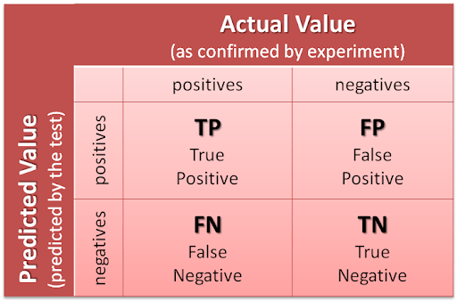
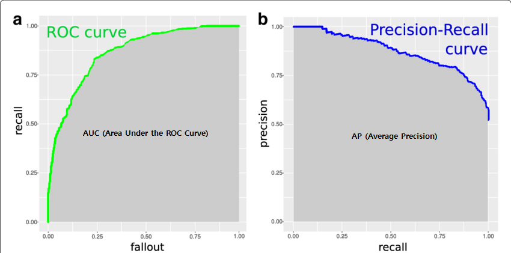

 
<b>

객체 탐지 평가기준 
1. 얼마나 잘 탐지 하였는지 평가 (탐지 정확성 - 분류 & 위치탐지)
2. 얼마나 빨리 탐지 하였는지 평가 (탐지 속도)

</b>
 

## 1) 얼마나 잘 탐지 하였는지 평가 (탐지 정확성 - 분류 & 위치탐지)

### <U>분류성능평가</U>

   
  <b>confusion-matrix</b>   
    

- TP(True Positive) : 긍정예측을 성공, 환자라고 예측해서 실제 환자임을 맞춤 
- TN(True Negative) : 부정예측을 성공, 비환자라고 예측하여 실제 비환자임을 맞춤 
- FP(False Positive) : 긍정예측을 실패, 환자라고 예측했지만 비환자임 
- FN(False Negative) : 부정예측을 실패, 비환자라고 예측했지만 실제 환자임

  

#### 분류성능평가지표

- **Precision (정밀도)** 

$$
Precision(정밀도) = \frac{TP}{TP + FP}
$$

모델이 True 라고 예측한 것 중 실제 True인 비율 
실제 False인 데이터를 True로 잘못 예측하면 큰 영향이 발생하는 경우 recall(재현율)보다 중요 (ex. 스팸메일)

  

- **Recall (재현율)**

$$
Recall(재현율) = \frac{TP}{TP + FN}
$$

실제 True인 것 중에서 모델이 True라고 예측한 비율 
실제 True인 데이터를 False로 잘못 예측하면 큰 영향이 발생하는 경우 precision(정밀도)보다 중요 (ex. 암 진단)

 

  > #### Precision-Recall Trade-off
  > 모델의 분류 결정 임계값(threshold) 설정에 따라 Precision(정밀도) 과 Recall(재현율)이 trade-off 관계로 변화하여 함께 늘리기가 힘듬. 
  > 정밀도와 재현율 중에 더 중요한 지표가 무엇인지 판단하고 임계값(threshold)을 조정 해야함.  

  

- **Accuracy (정확도)**

$$
Accuracy(정확도) = \frac{TP + TN}{TP + TN + FP + FN}
$$

전체 결과에서 True를 True로 False를 False로 예측한 비율 (precision과 recall과 다르게 False를 False라고 예측한 경우도 포함)

> #### accuracy(정확도) 만 봐서는 안되는 이유
> actual value가 negative로 편향되어있는 target에 TN이 높은 모델은 전체적으로 accuracy(정확도)는 매우 높지만 TP인 성능은 높지 않을 수 있음. 
> (ex. 맑은 날이 많은 지역에서, 맑을 것으로 예측하는 성능은 높지만 비가 오는 것을 예측하는 성능은 낮을 수 있음.) 
> 따라서, 이러한 경우 precision(정밀도)과 recall(재현율)을 확인하는 것이 좋음.  

  

- **f1 score**

$$
F_1 = 2 \cdot \frac{\text{Precision} \cdot \text{Recall}}{\text{Precision} + \text{Recall}}
$$

Recall(재현율)와 Precision(정밀도)을 이용하여 **조화평균**을 구하여 평가 척도를 구성하여 **데이터가 불균형한 상태일때 주요 척도**로 사용.

  

- **AP (Average Precision)**

   
  <b>average-precision</b>

 

$$
AP = \sum_{k=0}^{n-1} \left[ Recalls(k) - Recalls(k+1) \right] \cdot Precisions(k)
$$

$$
Recalls(n) = 0, \quad Precisions(n) = 1, \quad n = \text{number of thresholds}
$$

 

precision-recall 곡선은 알고리즘의 전반적인 성능을 파악하기에는 좋으나 **서로 다른 알고리즘의 성능을 정량적으로 비교**하기에는 어려움으로 AP를 이용하여 비교한다. 
AP는 각 threshold에서의 precision의 가중합을 의미하며, 이때의 가중치는 이전 threshold와 현재의 threshold 에서의 recall 값의 차이이다.  
결국에 AP는 Precisions의 Average를 대표하는 값으로 볼 수 있다.  
값이 클 수록 높은 성능을 의미한다. 

   
  <b>ROC curve 와 precision-recall curve</b>

 

`precision-recall curve 와 AP` 지표와 비슷한 지표로 `ROC curve 와 AUC` 지표가 있다.

  

- **mAP (mean Average Precision)**
분류시 하나의 객체(binary class)가 아닌 여러 객체(multi-class)의 경우, 모든 class의 AP를 평균낸 값이다.

  

### <U>위치탐지성능평가</U>

- **IoU (Intersection over Union)**

   
  <b>IoU</b> 

 

모델이 얼마나 객체의 위치를 정확히 찾았는지 측정할 수 있는 지표.

  

## 2) 얼마나 빨리 탐지 하였는지 평가 (탐지 속도)

- **FPS (Frames Per Second)**
초당 detection 하는 횟수. 예를 들어 10fps는 초당 10 frame을 detection 함을 의미.