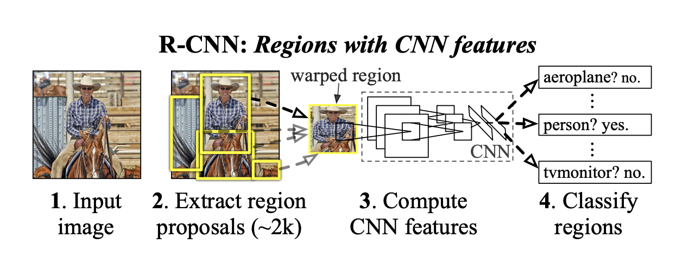
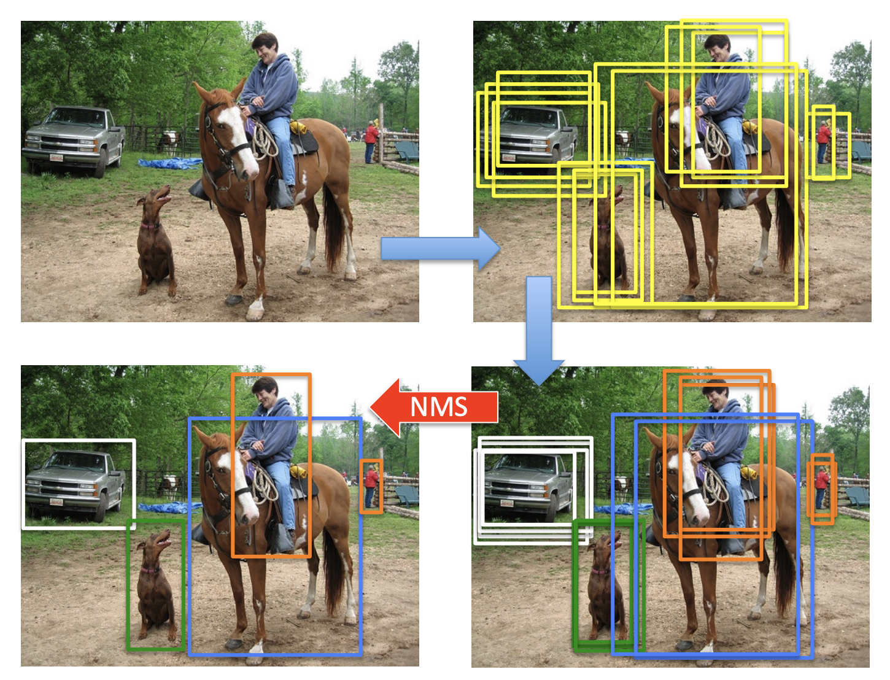
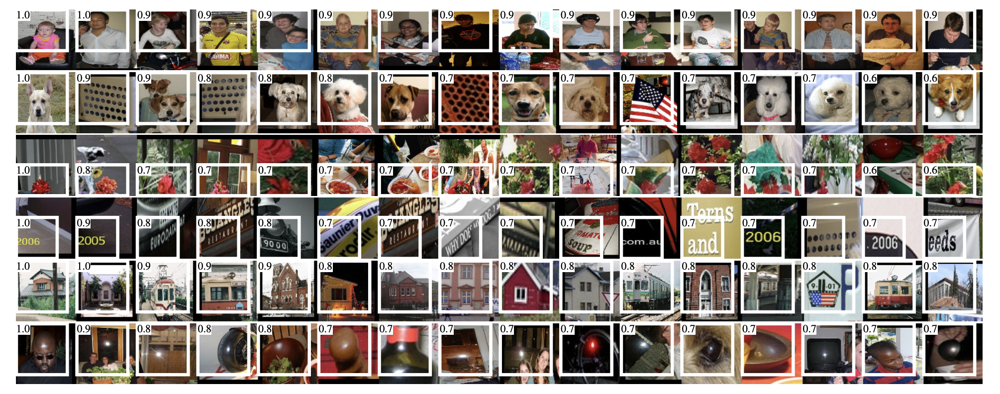
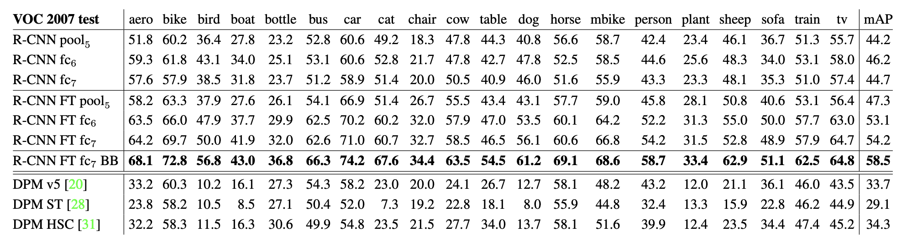
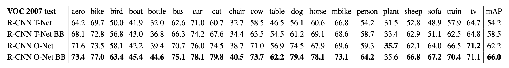
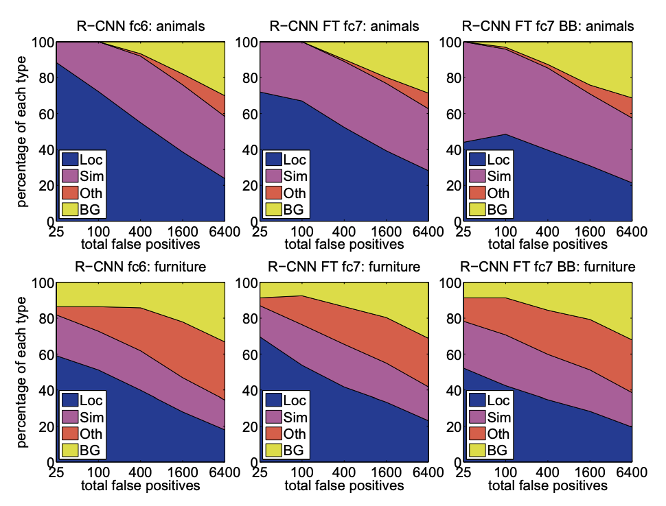
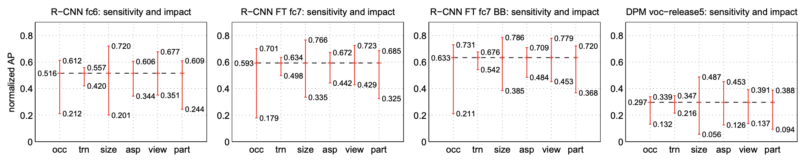
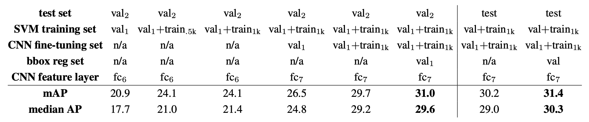

 

# R-CNN

## R-CNN 의 개요

    

1. 입력 이미지를 받는다. 
2. `Selective Search` 를 통해 약 2000 여개의 영역을 제안(Region Proposals)한다.  + 제안된 영역을 CNN을 사용하여 features를 얻기 위해 CNN의 input크기에 맞춰 일정한 크기로 조정한다. 
3. 크기를 조정한 영역을 `CNN(AlexNet)`에 넣어 features를 얻는다. 
4. `Support Vector machines(SVM)`을 이용하여 구해진 features를 분류한다.  

### Abstract
&nbsp;본 논문은 두가지 핵심을 사용한다. 
1. 객체 탐지를 위한 Region Proposals 에 CNN을 적용한다. 
2. labeled 된 훈련 데이터가 부족할때 `supervised pre-training` 과 `domain-specific fine-tuning` 을 통해 성능을 향상시킨다.  

## Object detection with R-CNN

- ### Object Localization
  &nbsp;논문에서 object localization을 위해 3가지 방법을 제시한다.  
  <ol>
    <li>
      <b>Regression</b> 
      &nbsp;Szegedy 의 연구의 결과로 좋지 못함을 알고 채택하지 않음. 
      <blockquote> C.Szegedy, A.Toshev, and D.Erhan. Deep neural networks for object detection. In NIPS, 2013.</blockquote>
    </li>
    <li>
      <b>Sliding Window</b> 
      &nbsp;R-CNN은 합성곱 층이 5개인 구조여서, 매우 큰 윈도우 (195\*195 pixels)와 Strides (32\*32 pixels)로는 정확한 localization 이 힘들기 때문에 채택하지 않음. 
    </li>
    <li>
      <b>Region Proposals</b> 
      &nbsp;`Selective Search` 를 채택 함. 
      <blockquote> C. Gu, J. J. Lim, P. Arbelaez, and J. Malik. Recognition using regions. In CVPR, 2009.</blockquote>
    </li>
  </ol>
   

- ### Feature Extraction
  &nbsp;CNN(AlexNet) 을 활용하여 각 region proposal에서 4096 차원의 feature vector을 추출한다.  
  &nbsp;feature vector을 얻기 위해, region proposal을 5개의 합성곱층과 2개의 완전 연결 계층으로 이루어진 CNN(AlexNet)의 input size인 (227*227 pixels)에 맞춰야 한다. 
  &nbsp;이를 위해, 어떠한 비율의 box든 input size로 변형(warping)을 해야하는데, 객체 영역만 tight 하게 자른 box가 아닌 p pixels 만큼 여유를 두고 자른 박스를 warping 합니다.(논문에서는 p = 16 을 사용하였다.) 
  > #### CNN( AlexNet ) 참고 논문
  > C.Szegedy, A.Toshev, and D.Erhan. Deep neural networks for object detection. In NIPS, 2013.  

- ### Test-time detection
  &nbsp;테스트 단계에서 CNN 을 통하여 얻은 region의 feature를 SVM을 사용하여 각 클래스 마다 점수를 매긴다. 
  &nbsp;한 이미지에서 이렇게 점수를 매긴 region을 각 클래스 별 독립적으로 `greedy non-maximum suppression`을 수행한다.
  > #### NMS (Non-Maximum Suppression)
  > 

  >  
  >  

  >  
  > object detector가 예측한 bounding box 중에서 정확한 bounding box를 선택하도록 하는 기법  

  > N. Bodla, B. Singh, R. Chellappa and L. Davis, Soft-NMS — Improving Object Detection with One Line of Code, in 2017
  
  #### Run-time analysis
  &nbsp;두가지 특징이 detection을 빠르고 효율적으로 만든다.
  1. 모든 클래스에서 CNN의 parameters를 공유한다.
  2. CNN을 통해 얻은 feature vectors(4k-dimention) 들은 다른 일반적인 접근법들보다 차원이 낮다.

- ### Training
  #### Supervised pre-training
  &nbsp;CNN(AlexNet)을 거대한 보조 data-set인 ILSVRC2012(이미지만 있고 bounding box 가 없는)로 이미지 분류를 위한 pre-training을 한다.  
  #### Domain-specific fine-tuning
  &nbsp;CNN이 warp된 proposal window(domain)에 잘 작용하기 위해, warp된 region proposal들 만 사용하여 stochastic gradient descent(SGD) 알고리즘으로 CNN parameters 를 훈련시켰다.  
  #### Object category classifiers
  &nbsp;객체를 분류할때, 찾으려는 객체가 완전히 들어와 있는 box는 positive 이고 객체가 조금이라도 들어와 있지 않는 box는 negative 이다. &nbsp;그렇다면 객체가 일부 들어간 box는 positive 일까 negative 일까? 
  &nbsp;이에 관하여 IoU 임계값이 {0,0.1,...,0.5}중 0.3 인 것이 결과가 가장 좋아 0.3이상인 것은 positive 아닌것은 negative으로 하였다. 
  &nbsp;CNN을 통해 features가 추출되고 training labels 가 주어지면 linear SVM을 각 클래스마다 훈련시켜야 한다. 
  &nbsp;이때 training data가 너무 많아 메모리가 꽉 차는 현상을 막기 위해 `hard negative mining method`를 채택하였다.
  > #### hard negative mining
  > &nbsp;positive example 과 negative example 을 균형적으로 학습시키 위한 기법. 
  > &nbsp;negative examples 가 있으면 confidence score 순으로 샘플을 선정 후, random하게 선정한 positive examples 를 갖고 하나의 mini-batch로 만들어 사용하는 방법. 
  > &nbsp;일반적으로 negative examples의 갯수가 훨씬 많은데, 그중 일부만 사용하여 메모리의 사용량을 줄일 수 있다.  

   
## Visualization, ablation, and modes of error
- ### Visualizing learned features
  &nbsp;CNN의 첫번째 계층은 경계와 보색을 찾아준다. 두번째 계층부터는 이해하기가 힘든데, 직관적으로 알아보려고 한다. 그 방법은 하나의 feature를 선택하여 마치 객체 탐지기 처럼 사용하는 것이다. 
  &nbsp;방법은 다음과 같다. 
  1. 많은 region proposals에서 feature들의 활성화를 계산한다. 
  2. 활성화가 큰 순서대로 정렬 한다.
  3. `non-maximum suppression`을 수행한다.
  4. 높은 점수의 region을 확인한다.
    
  

     
    <b>Figure 4: 5번째 pooling 후 높은 점수 의 후보 영역</b>
  

   
  나열된 점을 dog로 분류하고, 반사된 표면 등 분류된 결과를 볼 수 있다. 
  다음 결과로 보아 network는 약간의 class-tuned features와 함께 모양, 질감, 색상 및 재료 속성이 분포된 표현을 학습하는것으로 보인다. 
   
  
- ### Ablation studies
  > #### Ablation studies
  > 특정 요소가 전체 시스템에 어떤 영향을 주는지 확인하고 싶을때 해당 요소를 제거한 시스템과 비교해보며 확인하는 분석 기법.  
  
  

     
    <b>Table 2: PASCAL VOC 2007에서의 detection average precision(%)</b>
  

   
  &nbsp;R-CNN의 CNN은 AlexNet으로 5계층의 합성곱층과 2계층의 완전연결계층으로 이루어져 있다. 
  &nbsp;CNN의 마지막 풀링층을 pool5, 완전연결계층 2계층을 각각 fc6, fc7이라 명명하자. 
  
  #### Performance layer-by-layer, without fine-tuning
  &nbsp;먼저 fine-tuning을 하지 않았을 때 결과를 비교해 보기 위해 ILSVRC 2012 데이터로만 사전훈련한 CNN을 사용하여 분석하였다.  
  &nbsp;위 table 의 1-3행의 결과를 보면, PASCAL VOC 데이터에 fine-tuning을 하지않은 경우 fc7의 결과보다 fc6의 결과가 더 좋은것을 볼 수 있다. 이는, CNN의 매개변수의 29%인 약 1680만개를 mAP 저하없이 제거 할 수 있음을 의미한다. 
  &nbsp;이보다 더 놀라운 점은 pool5까지만 있는 네트워크에서도 pool5가 6%만큼의 features를 계산하지 않음에도 불구하고 꽤나 좋은 결과를 보여줬다는 것이다.
  &nbsp;이 결과로 CNN의 표현력의 상당부분은 합성곱층에서 온다는것을 알 수 있다.

  #### Performance layer-by-layer, with fine-tuning
  &nbsp;fine-tuning 을 했을때 결과를 비교해 보자.&nbsp;fc6 와 fc7의 결과가 pool5까지만 했을때 보다 훨씬 좋은것을 볼 수 있다. 
  &nbsp;이를 통해 대부분의 성능적 향상은 domain-specific non-linear clssifers(fc6, fc7)을 학습함으로서 얻을 수 있다는 것을 알 수 있다. 
   

- ### Network architectures
  

     
    <b>Table 3: PASCAL VOC 2007에서의 두개의 다른 CNN 구조의 detection average precision(%)</b> 
    T-Net = AlexNet / O-Net = VGG16
  

   
  &nbsp;위의 결과로 볼 수 있듯, AlexNet 대신 VGG16을 사용하면 성능이 더 좋아집니다. 하지만 연산속도가 7배 느려진다는 단점이 있다. 
   
  
- ### Detection error analysis
  > D. Hoiem, Y. Chodpathumwan, and Q. Dai. Diagnosing error in object detectors. In ECCV. 2012.

  &nbsp;저자의 방법에 error mode 를 구하고, fine-tuning 이 error mode를 어떻게 변화시키는지 그리고 저자의 error types 이 DPM과 비교하여 알아보기 위하여 위 논문에서 제시하는 analysis tool을 사용하였다. 
   
  

     
    <b>Figure 5: object characteristics 에 대한 sensitivity</b> 
  

   
  

     
    <b>Figure 6: top-ranked false positive(FP) types 의 분포</b> 
  

    

- ### Bounding-box regression
  &nbsp;error analysis 에 기초하여, 저자는 localization error를 줄이기 위해 간단한 method를 구현하였다. 
  &nbsp;`deformable part model (DPM)`에 적용된 bounding-box regression 에 영감을 받아, selective search 의 region proposals 에 대한 pool5의 feature이 주어지면 새로운 detection window를 예측하기 위해 선형회귀 모델을 훈련한다. 
  
  > bounding-box regression 에 대한 자세한 사항은 Appendix C 참고.

  &nbsp;Table1, Table2, Figure5를 보면 이러한 간단한 접근이 많은 mislocalized detection들을 해결 하며 mAP를 3~4 point 향상 시키는 것을 볼 수 있다. 
   

- ### Results on PASCAL VOC 2010-12
  

     
    <b>Table 1: VOC 2010 test set 에 대한 Detection average precision(%)</b> 
  

   

- ### Results on ILSVRC2013 detection
  

     
    <b>Figure 3: ILSVRC2013 detection test set 에 대한 mAP</b> 
  

   

## The ILSVRC2013 detection dataset
  ILSVRC2013 dataset은 PASCAL VOC dataset보다 균일하지 않다. 따라서 데이터 선택에 중요성을 요구한다.
  
- ### Dataset overview
  ILSVRC2013 은 다음과 같이 분류됩니다. 
  + <b>val</b> (20,121 개) & <b>test</b> (40,152 개) 
    &nbsp;검증 데이터와 테스트 데이터는 같은 이미지 분포로 이루어져 있고 모든 클래스(200 개)에 대해 bounding box 와 labeled가 되어져 있다.(annotated 됨)
  + <b>train</b> (395,918 개) 
    &nbsp;훈련 데이터는 완전히 annotated 되어 있지 않다. 
   

  &nbsp;훈련 데이터는 완전히 annotated 되어 있지 않기 때문에 `hard negative mining`을 사용 할 수 없다. 
  &nbsp;이를 해결하기 위해 검증 데이터를 동일한 비율의 class로 val1과 val2로 같은 양으로 나눈다. 그리고 val1 과 훈련 데이터의 일부를 사용하여 positive examples로 활용한다. 
   

- ### Region proposals
  &nbsp;ILSVRC 2013에서도 PASCAL VOC에서와 같이 Selective search 가 val1, val2, test 이미지 각각(훈련 데이터는 빼고)에 fast mode 로 적용하는 방식으로 region proposals를 수행한다. 
  &nbsp;한가지 다른점이 있다면, selective search는 scale invariant 하기 때문에 이미지의 크기(해상도)에 따라 region 생성의 수에 영향을 미치는데, ILSVRC 이미지는 크기가 일정하지 않다는 것이다. 
  &nbsp;이를 위해 selective search를 수행하기 전 각 이미지 마다 500 pixels로 너비를 고정 하였다. 
   

- ### Training data
  &nbsp;훈련 데이터는 다음과 같이 만들었다. 
  + <b>훈련 데이터</b> = <b>val1 의 <u>모든 selective search 와 ground-truth box</u></b> + <b>train 의 <u>각 class당 N개의 ground-truth box (만약 N개보다 적을경우 모든 box를 사용)</u></b> 

  &nbsp;저자는 이를 val1 + trainN 라 명명 한다.  
  &nbsp;훈련 데이터는 R-CNN에서 다음 3가지 절차를 수행하는데 필요하다.
  1. <b>CNN fine-tuning</b> : PASCAL에서 훈련한 것과 같이 val1과 trainN 으로 5만번의 SDG iteration을 수행하여 fine-tuning
  2. <b>SVM 검출기(detector) training</b> : val1과 trainN의 모든 ground-truth boxs를 사용. val1에 Hard negative mining 을 사용하여 5000개의 이미지를 선별. train는 완전히 annotated 되지 않기 때문에 negative examples을 선별하지 않음.
  3. <b>bounding-box regressor training</b> : val1 만 사용하여 훈련
    

- ### Validation and evaluation
  &nbsp;결과를 평가 서버에 제출하기 전, 훈련 데이터 사용의 검증과 위의 데이터를 사용하여 훈련한 CNN fine-tuning과 bounding-box regressor의 영향을 val2를 사용하여 검증하였다. 
  &nbsp;추가적인 tuning 없이 ILSVRC 에서 R-CNN의 결과를 확인하기 위한것 이기 때문에 모든 시스템의 hyperparameter은 PASCAL에서 사용한것과 똑같이 고정하였다. 
  &nbsp;val2에서 가장 좋은 결과를 보인 모델을 선택하여, bounding-box regression이 있는 모델과 없는 모델을 ILSVRC2013 평가 서버에 올렸다. 
   
  제출을 위해 사용된 training-set은 다음과 같다.
  + <b>SVM</b> : val + train1k
  + <b>bounding-box regressor</b> : val
  + <b>CNN</b> : val1 + train1k
    
  
  CNN은 fine-tuning과 feature 계산을 반복 하지 않기 위해 val1 + train1k를 사용하였다. 
   
- ### Ablation study
  

     
  
    <b>Table 4: data usage choices, fine-tuning, bounding-box regression 에 관한 ILSVRC2013 ablation study </b> 
  

   

- ### Relationship to OverFeat
  R-CNN 과 OverFeat은 다음과 같은 차이점을 제외하면 매우 비슷하다.  

  | R-CNN                  |   | OverFeat            |
  |------------------------|------|---------------------|
  | selective search       | 영역추정 | multi-scale pyramid |
  | per-class BB regressor | BB   | single BB regressor |
  
   
  OverFeat은 R-CNN보다 성능은 떨어지지만 9배 더 빠르다. 이러한 속도적 이점은 sliding windows 기법은 이미지 warping이 필요 하지 않기 때문이다. 
   

## Conclusion
  Abstract 에서 말한것과 같이, 
  1. region proposals 를 통한 객체탐지
  2. labeled 된 훈련 데이터가 부족할때 supervised pre-training 과 domain-specific fine-tuning 을 통해 성능을 향상 
  => labeled되지 않은 많은 데이터로 supervised pre training을 하고 (image classification) 그리고 나서 적은 labed된 영역을 가지고 fine-tuning한다 (detection). 
   
  
  을 통하여 좋은 결과를 보였다.

  